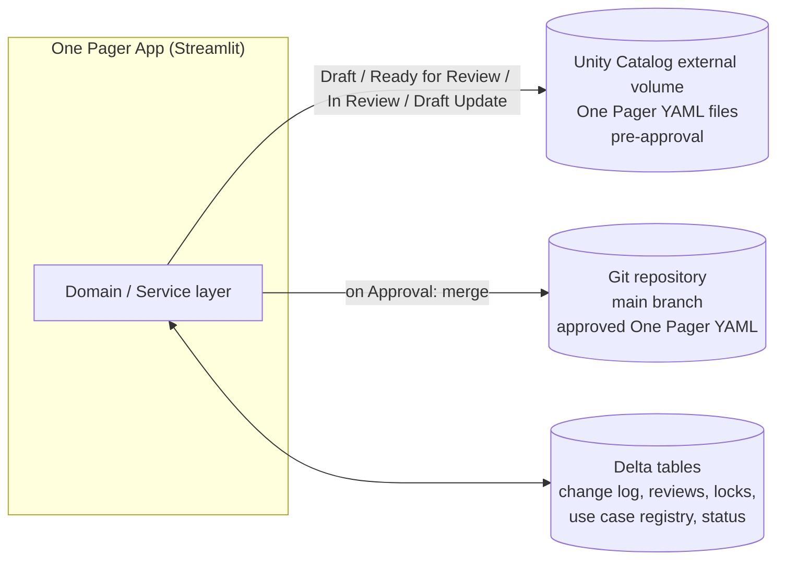

# One Pager Application — Architecture Decisions

## 1. Purpose

This document defines the technical architecture for the One Pager Application: a Databricks App with a Streamlit UI that implements the process and rules defined in [One_Pager_App_Requirements_and_Scope.md](../one-pager/One_Pager_App_Requirements_and_Scope.md).

## 2. Hosting & Tech Stack

| Layer | Choice |
|---|---|
| Hosting | Databricks App (managed serverless hosting inside the Databricks workspace) |
| UI | Streamlit (multipage app) |
| Domain/service layer | Plain Python package, importable and unit-testable without Streamlit running |
| Validation | JSON Schema validation (`jsonschema`) directly against `structure_one_pager_v_1.json`, applied in the lenient/strict tiers defined in the requirements doc §5 |
| Data access | Databricks SDK / Databricks SQL connector for Delta tables; volume/file APIs for the YAML files; Git integration for the merge-to-`main` step (see §6). Delta reads run as the signed-in user, all writes as the app's service principal (see §8, "Data access identity") |
| Storage | See §5 |
| Auth | Databricks Apps native user identity, combined with Entra ID role groups and per-record ownership checks (see §4) |
| CI/CD | Databricks Asset Bundles (DAB) + a standard CI pipeline (lint → unit tests → bundle validate → deploy) |

**Deployment scope**: a single app instance serves all business domains. Business domain is a document attribute (used for filtering/reporting), not a deployment boundary.

## 3. Layering

```
┌──────────────────────────────────────────────┐
│ Streamlit Pages (View)                        │  renders state, captures input only
├──────────────────────────────────────────────┤
│ Presentation helpers (per-page state)         │  maps user intent -> service calls
├──────────────────────────────────────────────┤
│ Domain/Application layer                      │  pure Python, no Streamlit import:
│  - workflow rules (status transitions)        │    validation, state machine, permissions
│  - validation (schema + business rules)       │
│  - permission checks                          │
├──────────────────────────────────────────────┤
│ Data/Infrastructure layer                     │  Delta tables, UC volume, Git, auth
└──────────────────────────────────────────────┘
```

Streamlit pages never talk to storage directly and never contain workflow/validation/permission logic — they only call into the domain layer. This keeps business rules unit-testable and the UI replaceable.

### Streamlit session & state management

Streamlit re-runs the entire page script on every widget interaction. This has direct implications for form state, locking, and concurrency:

- **In-progress form data**: all editor form state (the One Pager being edited, partial field entries, the active tab) is held in `st.session_state` so it survives re-runs. Content is never lost due to a re-run or a transient error — it stays in session until the user explicitly saves, cancels, or the session ends.
- **Pessimistic lock heartbeat**: the app acquires a lock when the user enters edit mode (requirements doc §10). Because Streamlit has no server-side heartbeat, the lock is **refreshed on re-runs** (i.e., on widget interactions) by updating the lock timestamp in Delta, at most once per TTL/6 (every 5 minutes by default) so that not every interaction waits for a warehouse write. If no re-run occurs for 30 minutes (the lock's expiry window), the lock expires and another user can take over. This is a natural fit for Streamlit's execution model — user activity = re-runs = heartbeats.
- **Multi-tab / duplicate-session handling**: if the same user opens the same One Pager in edit mode in two browser tabs, the second tab's attempt to acquire the lock will detect the existing lock (held by the same user) and either reuse it (same session) or warn the user that they already have it open elsewhere. The app does not silently allow two parallel editing sessions for the same document, even by the same user.
- **Session loss**: if the user's browser tab is closed or the Streamlit session is otherwise lost, all unsaved content in `st.session_state` is lost. The lock expires after 30 minutes but content is not recovered. This is an accepted limitation of the current phase; periodic auto-save to a Delta-backed draft buffer may be added in a future release (requirements doc §16).

## 4. Authentication & Authorization

### Identity
The app uses Databricks Apps' native user authentication; the authenticated user's identity is available to every request and is the basis for all permission checks.

- **Source of identity.** When deployed, the username is taken only from the headers the Databricks Apps proxy sets (`x-forwarded-email` / `x-forwarded-preferred-username`). There is no fallback to a database lookup in deployed mode, because writes run as the service principal (see §8) and a wrong identity would be written into the audit columns. Locally, `local-integration` uses `SELECT current_user()` with the CLI profile and `local-mock` uses a configured mock user.
- **Username format.** Usernames currently look like `x0wadm@becoc001.onmicrosoft.com`: the user's **corporate initials** (`X0W`), a suffix (`adm`) and the domain. The suffix may be dropped in the future (`x0w@…`) and the domain may change. The accepted domains, the suffixes to strip and the pattern for valid initials are therefore **settings**, not code:
  - `ONE_PAGER_APP_USER_DOMAINS`: accepted domains, default `becoc001.onmicrosoft.com`. Old and new domains are never valid at the same time, so a domain change is a configuration change made at the switch.
  - `ONE_PAGER_APP_USERNAME_SUFFIXES`: suffixes stripped from the user part (longest first), default `adm`. An empty entry means "no suffix": when usernames become `x0w@…`, set `adm,` for the switch and an empty value afterwards.
  - `ONE_PAGER_APP_INITIALS_PATTERN`: valid initials after upper-casing, default `^[A-Z0-9]{3}$` (always 3 letters or digits; case does not matter).

  The initials are derived in one place (`auth.initials_from_username`); a username that does not match gets no initials. The same pattern validates Owner/SME initials entered in a One Pager; entered initials are upper-cased first, so `x0w` is stored as `X0W`.
- **Corporate initials are not personal initials.** Corporate initials are assigned by the company, may contain digits (`X0W`) and can differ from a person's name initials (e.g. `AK`). Only corporate initials are used by the app.
- **Fail closed.** A request without the proxy headers, or a username whose domain, suffix or initials do not match the settings (e.g. a guest or a service account), gets no initials and is refused with an "account not recognised" page. The app never guesses initials from an unrecognised username. The check runs in `app.py` before any page or data access is created, and the refusal is logged once per session as a `permission_denied` security event (`action=access_app`, with the username, because there are no initials). Every service entry point checks again that the user has initials (`permissions.require_identity`), so a missing identity can never reach a write.
- **Display name.** First name and surname are read once per session from the workspace directory (`directory.py`: SCIM `Me`, `GET /api/2.0/preview/scim/v2/Me`, user API scope `iam.current-user:read`). The name shown is `givenName familyName`, else `displayName`, else the initials; it is never guessed from the username. Deployed, the lookup uses the user's forwarded token (never the service principal, which would return the app's own entry); `local-integration` uses the CLI profile; `local-mock` uses `ONE_PAGER_APP_MOCK_USER_NAME`. A failed lookup is logged and the initials are shown; it never blocks the app. The display name is used for display only (sidebar, change log, YAML `createdBy`, review comments, locks, PDF, the pre-filled Owner row); it is never used for authorization.
- **Data access identity.** Reads run as the signed-in user and writes as the app's service principal ("option B", §8, Decision_Log §19): users keep Unity Catalog as a second line of defence for what they can see, but cannot change the app's tables outside the app's workflow and checks. Because Delta history then shows the service principal, every write records the acting user's initials (Data_Model §5).

### Coarse-grained role (which of Owner / Approver / Admin / Viewer a user can act as)
Backed by three **Entra ID groups**, one per role that isn't purely per-record. Automatic identity management is enabled on the Databricks account, so Entra ID groups (including nested groups) are available in Databricks without a separate sync:
- **Owner/SME group** — all DP Owners/SMEs company-wide; gates the "Create New One Pager" action and managing Use Cases (general eligibility to be an owner/SME at all). This is separate from the per-Data-Product ownership check below, which governs editing a *specific* existing One Pager; being listed as Owner or SME of a One Pager is enough to edit it, without the group.
- **Approver group** — Nykredit reviewers
- **Admin group** — Platform team representatives
- **Viewer** — every employee. There is no Viewer group: every signed-in, recognised user who is in none of the groups above is a Viewer. Access to the app itself is controlled by the Databricks App's `CAN_USE` permission.

A user may hold several roles (e.g. Approver in general and Owner of one One Pager); segregation of duties is checked per One Pager (see "Approval model").

**How roles are resolved.** Once per session, after the identity check, one SQL statement run with the **user's** token checks the three groups (`is_account_group_member(<group>) OR is_member(<group>)`; `DataAccess.get_group_memberships`, `auth.resolve_roles`), so the check needs no extra permission for the app. The result is kept in the session; a membership change applies from the next session. If the check fails, the user is treated as a Viewer (fail closed) and the error is logged. The pages use the roles to show actions, and the service layer checks them again (e.g. `create_one_pager` and the Use Case writes require the Owner/SME group role). The sidebar shows the roles as badges ("Viewer" when there is no other role).

**Group names are settings** (`ONE_PAGER_APP_GROUP_OWNER_SME`, `ONE_PAGER_APP_GROUP_APPROVER`, `ONE_PAGER_APP_GROUP_ADMIN`). A `{env}` placeholder is replaced with the environment (`DEV`, `INT`, `TST`, `UAT`, `PRD`). In `local-mock` mode the memberships come from `ONE_PAGER_APP_MOCK_GROUPS` (default: the interim group, i.e. every role).

> **Interim groups.** The three role groups have not been created yet. Until they are, every role uses the Data Platform Engineering group of the environment, `PAG-BEC-LHX-{env}-DataPlatEng-Base` (the default of all three settings). Members of that group act as Owner/SME, Approver and Admin; all other employees are Viewers. The app logs a warning and, outside DEV, shows an "interim roles" notice in the sidebar while the default is in use. Switching to the real groups is a configuration change only.
>
> **Group membership** is managed in Entra ID by the owning team (for now the Data Platform Engineering team), not in the app.

Using a group for the general Owner/SME population (rather than only per-record checks) closes a gap the per-record model alone doesn't cover: there is no existing document to check membership against before someone creates the *first* One Pager for a new Data Product. The group answers "is this person allowed to create One Pagers at all?"; the per-record check (below) answers "is this person allowed to edit *this* One Pager?"

### Fine-grained edit authorization (per Data Product)
A user may create/edit a specific One Pager only if they match that document's `dataProductOwner` or one of its `smes` entries. The matching algorithm uses the `initials` field as the sole authorization key:

1. Extract the authenticated user's corporate initials from their Databricks identity (e.g., from the username `x0wadm@becoc001.onmicrosoft.com` → `X0W`), using the configured domains, suffixes and initials pattern (see "Identity"). The extraction logic is isolated in the auth module, and a change of the username format is a configuration change.
2. Compare the extracted initials against the `initials` field of `dataProductOwner` and each entry in `smes`.
3. If any `initials` value matches, access is **granted**. The `email` field is not checked for authorization — it is stored for display purposes and cross-reference only.

This design ensures that authorization remains stable even if the corporate email/username format changes in the future, since `initials` is expected to be a permanent, format-independent identifier.

This check is enforced in the domain/service layer on every write operation, not only by hiding UI controls — a request to edit a One Pager the user isn't listed on is rejected server-side regardless of what the UI shows.

### Approval model
Any one authenticated Approver may approve or reject an `In Review` One Pager — there is no multi-approver/quorum requirement. This matches the transition table already defined in the requirements doc (§6), where `In Review → Approved`/`Draft` is attributed to "Approver" as a role, not a named individual.

**Segregation of duties:** An Approver who is also listed as the Data Product Owner or as an SME on a given One Pager may **not** approve or reject that One Pager. The permission check in the domain layer verifies that the authenticated Approver's initials do not appear in `dataProductOwner` or `smes` for the target document. This prevents self-approval and is consistent with the banking/audit context (requirements doc §6).

### Read access
All authenticated users may view any One Pager regardless of role or ownership — read access is unrestricted by design (requirements doc §3). The `dataClassification` field on a One Pager describes the classification of the **Data Product's own data** (e.g. whether CPR numbers in the product are Confidential), not the One Pager document itself. The One Pager contains only business descriptions and metadata, not actual customer data, so restricting read access by classification level is not required.

### `dataProductStatus` ownership
The transition from `In Definition` to `Ready for Development` is triggered **automatically by the system** when a One Pager is first approved — it is not an Owner-initiated action.

All subsequent `dataProductStatus` transitions (`Ready for Development → In Development → Active → Deprecated`) are performed **only by the Data Product Owner and its assigned SMEs** — the same per-Data-Product fine-grained authorization used for editing the One Pager itself applies here. The Admin role has no authority over these transitions; its only Data-Product-related action is Cancel (which only applies pre-approval, while status is `In Definition`), per the requirements doc §6. No external system writes to `dataProductStatus` directly; if an external build/ops system needs to reflect these transitions, it should read them from this app's Delta tables rather than write to them. This "no external writes" constraint is an architecture decision — the requirements doc is silent on external system interaction.

When a One Pager that has already been approved once goes through a `Draft Update` review cycle and is **re-approved**, the system automatically sets `dataProductStatus` to `In Enhancement` — signaling that the updated definition is approved and the corresponding changes to the Data Product need to be implemented. This mirrors how the first approval automatically sets `dataProductStatus` to `Ready for Development`.

## 5. Data Storage Architecture

### Catalog strategy

The One Pager application uses a **dedicated Unity Catalog catalog per environment** (e.g. `dev_one_pager`, `prd_one_pager`). This provides full isolation of schemas, tables, and volumes from other applications, simplifies RBAC (the service principal's grants are scoped to the catalog), and avoids naming collisions with existing data assets. Actual catalog names follow BEC's naming convention and are parameterized via the Databricks Asset Bundle (see [One_Pager_App_Project_Structure.md §4](One_Pager_App_Project_Structure.md#4-environment-topology)).

### Table engine: Delta (with Lakebase migration path)

All application tables use **Delta tables** in the current phase. Delta is well-supported across all Databricks workspace tiers, compatible with the existing Databricks SQL connector and Liquibase provisioning, and sufficient for the expected scale (dozens to low hundreds of One Pagers, single-digit concurrent editors).

However, several tables have transactional access patterns (high-frequency row-level updates, atomic increments, FK integrity) that would benefit from Lakebase (PostgreSQL-compatible managed tables in Unity Catalog) if it becomes available in the target workspaces. The following tables are **Lakebase migration candidates**:

| Table | Why Lakebase is a better fit |
|---|---|
| `locks` | Heartbeat UPDATEs while editing (at most every 5 minutes per editor); Delta small-file accumulation requires periodic OPTIMIZE |
| `id_sequences` | Atomic increment with retry on `ConcurrentAppendException`; native `SERIAL` / `RETURNING` in Lakebase eliminates this |
| `one_pager_status` | Frequent single-row UPDATEs (status, version, timestamps); physical UNIQUE constraint on `data_product` |
| `one_pager_authorized_users` | Frequent permission lookups; FK integrity enforced by DB instead of app code |
| `use_cases` + `use_case_references` | CRUD with FK relationships; referential integrity enforced at DB level |

The remaining tables (`change_log`, `review_comments`, `ref_*` tables) are append-only or rarely updated and are well-served by Delta.

**Migration approach:** the repository module (`onepager_core/repository.py`) uses parameterized SQL via the Databricks SQL connector for all table access. Migrating a table from Delta to Lakebase requires changing the DDL (Liquibase changeset) and potentially adjusting a few SQL idioms (e.g. replacing Delta MERGE with standard UPSERT), but does not affect the domain layer or UI. The migration can be done table-by-table without a big-bang rewrite.



- **Pre-approval** (`Draft`, `Ready for Review`, `In Review`, `Draft Update`): the One Pager's YAML file lives in a Unity Catalog external volume. The app reads/writes it directly.
- **On Approval**: the YAML is pushed to the OnePagerRegistry Git repository via a PR. The **target branch depends on the environment**: PRD writes to `main` (the authoritative record of production-approved One Pagers); DEV/INT/UAT write to environment-specific branches (`dev`, `int`, `uat`). This prevents test approvals from polluting the production registry. See §6 for details.
- **Everything else** (change log, review comments/decisions, locks, the shared Use Case registry, status metadata) lives in Delta tables in Unity Catalog, regardless of the One Pager's status.
- **Business Requirement / Use Case / One Pager IDs** are generated by the app from a Delta-backed sequence/counter table, guaranteeing global uniqueness (per requirements doc §14) without relying on the Git or volume storage layers.

### Volume file layout

Each Data Product has exactly one One Pager (1:1 relationship) — the One Pager ID (`OP-####`) is immutable and stable across all lifecycle stages. YAML files in the UC external volume are organized by OP-ID, with all versions stored as immutable files in a single directory. The current version is read from the Delta `one_pager_status.version` column — there is no pointer file.

```
<volume_root>/
  <OP-ID>/
    <OP-ID>_v0.1.0.yml       # All versions stored as immutable files
    <OP-ID>_v0.2.0.yml
    <OP-ID>_v0.3.0.yml
    <OP-ID>_v1.0.0.yml       # Approved versions also here (no separate folder)
    <OP-ID>_v2.0.0.yml
```

**Key design properties:**

- **Stable paths via OP-ID** — All versions of one One Pager live under `<OP-ID>/`, and each filename is derived from the OP-ID, which never changes. Immutable one-per-version files ensure no overwrites or accidental loss.
- **Rename is Delta-only** — The data product name is not in the path or filename, so a product rename touches zero files; only `one_pager_status.data_product` changes.
- **Complete version history** — All versions (draft, approved, re-approved) stored in one place, enabling full audit trail and rollback without separate archives.
- **Current version from Delta** — `one_pager_status.version` is the single source of truth; the file to read is `<OP-ID>_v<version>.yml`. No `_latest.*` pointer to keep in sync.
- **Status determined by Delta, not path** — Whether a version is `Draft`, `In Review`, or `Approved` is determined by `one_pager_status.one_pager_status` table, not by folder structure.

**Lifecycle operations:**

| Phase | Action | Storage |
|---|---|---|
| Create One Pager | Write file v0.1.0; insert Delta row | `OP-0001/OP-0001_v0.1.0.yml` |
| Save draft (v0.2.0) | Write new file; bump `one_pager_status.version` | `OP-0001/OP-0001_v0.2.0.yml` |
| Submit for review | No file change; update Delta status | Same files |
| Approve (v1.0.0) | Write new file (MAJOR bump); update Delta status + `version` | `OP-0001/OP-0001_v1.0.0.yml` |
| Rename product | No file change; update `one_pager_status.data_product` | Same files |
| Draft Update | Write v1.1.0; bump Delta `version` | `OP-0001/OP-0001_v1.1.0.yml` |

- All versions of a One Pager are retained in the volume for complete audit history, enabling version history and rollback capability (see requirements doc §7).
- **Draft Update lifecycle**: when an Owner triggers "Update" on an Approved One Pager, the app reads the approved YAML from Git (the authoritative source — `main` in PRD, env branch in DEV/INT/UAT) and writes a new version to the same `<OP-ID>/` directory, beginning a new cycle (incrementing MINOR from the last approved version: e.g., `1.0.0` → `1.1.0`). Edits are applied throughout the `Draft Update → Ready for Review → In Review` cycle, with each content save incrementing MINOR (e.g., `1.1.0` → `1.2.0`). On re-approval, a new MAJOR version is written (e.g., `2.0.0`) and pushed to Git via a PR (§6).
- **Git as authoritative for approved versions**: approved versions are pushed to Git as the long-term record. Volume serves as working storage and backup; if Git is available, it's the source of truth for approved versions.

For a detailed rationale and tradeoff analysis, see [Decision_Log.md](Decision_Log.md) §6.


## 6. Git Merge-on-Approval Mechanism

**Decision: the app opens a pull request automatically on approval**, rather than committing directly to `main` or leaving the merge as a fully manual step.

### Target branch per environment

A single OnePagerRegistry repository is shared across all environments, using a **branch-per-environment** strategy:

| Environment | Target branch | Purpose |
|---|---|---|
| PRD | `main` | Authoritative production registry of approved One Pagers |
| UAT | `uat` | Stakeholder-validated approvals; mirrors production flow without affecting `main` |
| INT | `int` | Integration-test approvals; may contain synthetic/test data |
| DEV | `dev` | Developer-test approvals; frequent, disposable |

The target branch is injected via the `ONE_PAGER_GIT_TARGET_BRANCH` environment variable, set per Databricks Asset Bundle target. Only the PRD app writes to `main`; non-prod branches can be periodically reset from `main` to re-sync with production data if needed.

Rationale:
- The One Pager has already been reviewed and approved inside the app — a PR is not a second content review, just the mechanism for landing an already-approved change in Git.
- Direct-to-`main` commits from an app service identity are unlikely to be permitted under typical branch-protection policies at a bank, and bypass any required CI checks (e.g. schema re-validation) configured on the repo.
- A fully manual handoff (a person copies the file into Git themselves) reintroduces the risk this project is trying to remove: a step that can be forgotten, delayed, or done incorrectly, breaking the "Approved One Pager = ready for build" guarantee.
- A PR gives a natural point to run an automated schema-validation check before merge, and — if the repo's branch protection requires human sign-off — a lightweight, fast confirmation step (not a content re-review) rather than a manual file copy.

Implementation notes:
- If the repository's branch protection allows it, configure auto-merge once required checks pass, so the process is effectively fully automated end-to-end.
- If human sign-off is required by policy, that responsibility falls to the Admin role, as a quick merge confirmation — not a content review.
- This should be validated against the actual repository's branch protection rules once known; flagged as an implementation detail to confirm during Step 3 (project structure & tooling).
- **File handling on re-approval:** the PR replaces (overwrites) the existing YAML file at `<data_product>/<OP-ID>.yml` in the target path. Each One Pager maps to exactly one file, so re-approval is a simple file update, not a complex merge.
- **Concurrent approvals:** because each One Pager writes to its own file path (`<data_product>/<OP-ID>.yml`), PRs from different One Pagers do not conflict. If two PRs for the *same* One Pager somehow overlap (not possible under normal workflow since the OP can only be `In Review` once), the second PR creation would detect the existing open PR and skip creating a duplicate.

## 7. Error Handling & Transactional Integrity

### Multi-step operations
Several operations span more than one storage backend (YAML volume + Delta tables, or Delta + Git). The two most critical are:

**Save (Draft / Draft Update editing)**
1. Validate content (domain layer).
2. Write the YAML file to the UC volume.
3. Write the change log entry + update status metadata in Delta.

If step 3 fails after step 2 succeeds, the volume has a newer file than the Delta tables reflect. Mitigation: perform the Delta write first (since it's the system-of-record for status/changelog), then write the YAML file. If the YAML write fails, roll back the Delta change log entry (or mark it as failed) and show the user an error. The user's in-progress content is still held in `st.session_state` and is not lost — they can retry.

**Approval**
1. Set One Pager status to `Approved` and Data Product status to `Ready for Development` / `In Enhancement` in Delta.
2. Write the final YAML to the UC volume (or confirm it's already current).
3. Create a Git pull request.

If step 3 (Git PR) fails after steps 1–2 succeed, the One Pager is marked Approved in Delta but has no PR in Git. Mitigation:
- Record a pending-PR flag in Delta alongside the Approved status.
- A background retry mechanism (a lightweight scheduled job or an on-next-access check) detects the missing PR and retries creation.
- The Help/Admin page shows any One Pagers stuck in "Approved but PR not created" so the Admin can intervene manually if automated retry fails.
- The approval is **not rolled back** — the business decision (approval) is valid; only the Git delivery step failed.

### General error-handling principles
- **User-facing errors**: show a clear, actionable message ("Save failed — your changes are preserved, please retry") rather than raw exceptions. Never expose stack traces or internal identifiers to the user.
- **Idempotent retries**: all write operations are designed to be safely retryable (e.g., a second YAML write with the same content is harmless; a second PR creation for the same version is detected and skipped).
- **No silent data loss**: if a save/submit/approve operation fails at any step, the user's in-progress content remains in `st.session_state` and the UI does not navigate away from the editor.

## 8. Security & Logging Baseline

- All permission checks happen server-side in the domain/service layer (§3, §4) — never only in the UI.
- PII-flagged data (per `dataClassification`/`containsPII` on individual data elements) is never written to application logs; logs reference field names and record IDs, not values.
- Free-text fields (descriptions, change summaries, review comments) are sanitized before storage (HTML tags stripped, maximum length enforced) and rendered without `unsafe_allow_html` in Streamlit, to prevent stored XSS.
- All Delta table operations use **parameterized queries** (via the Databricks SQL connector's parameter binding) — never string concatenation of user-supplied values into SQL, to prevent injection.
- The app's own service identity (for volume/Delta/Git access) follows least privilege: read/write scoped to the One Pager volume, its Delta schema, and the specific Git path used for approved One Pagers — not broader workspace access.
- Input validation happens at every write boundary (schema validation + business rules from requirements doc §5), regardless of what the UI already checked client-side.
- The CI pipeline includes a **dependency vulnerability scan** via GitHub Advanced Security, to catch known CVEs in third-party packages before deployment.

### Security-event logging
The application logs security-relevant events in a structured format for audit and incident response:
- Failed permission checks (user attempted an action they are not authorized for).
- Rejected edit attempts (user not listed as Owner/SME on the target Data Product).
- Lock override events (lock expired and taken over by another user).
- Status transitions (who triggered which transition, when).
- Every successful or failed write, with the acting user's initials and the record ID: create and save of a One Pager, review comments, edit locks (acquire, release), Use Case links, Use Cases (create, edit, deprecate, restore) and Admin changes to reference data. This is the second record of who did what, next to the app's audit columns (§ Audit-trail tradeoff below, Data_Model §5). Lock heartbeats are not logged: they only extend the user's own lock.
- Refused accounts (no recognised username), with the username.

These logs do not contain field values or PII — only user initials, record IDs, action names, and outcomes; the one exception is the username of a refused account.

### Data access identity — reads as the user, writes as the service principal
Platform rule: users have no direct privileges on Databricks resources; privileges are granted to groups. The app therefore uses two identities (Decision_Log §19):

| Operation | Runs as | Why |
|---|---|---|
| Delta **reads** (Registry, Preview, change log, comments, locks, Use Cases, reference data, role check) | The signed-in **user**, with the token Databricks Apps forwards (`x-forwarded-access-token`, scope `sql`) | Unity Catalog stays a second line of defence: users only see what their groups may `SELECT`. |
| Delta **writes** (`INSERT` / `UPDATE` / `DELETE` / `MERGE`), and reads that are part of a write (ID sequence compare-and-set, lock checks) | The app's **service principal** | Users get no `MODIFY` grant, so nobody can change the app's tables outside the app and bypass the workflow, validation or segregation of duties. |
| Volume (YAML documents), Git | The app's **service principal** | Same reason; all One Pagers are readable by every user anyway. |

**Volume access.** Databricks Apps do **not** mount Unity Catalog volumes: `/Volumes/...` does not exist in the app container, and writing there as a local folder fails with `Permission denied: '/Volumes'`. The YAML documents are therefore read and written through the Files API (`documents/files.py`, `VolumeFiles`), always as the service principal; there is no per-user file access. Writes therefore already follow the rule above. Reading YAML as the service principal is accepted: every signed-in user may view every One Pager (Backend_Design §5), and the permission to open a One Pager is checked by the app, not by the volume. Users need no `READ VOLUME` grant.

**Implementation.** `DatabricksConnection.execute_statement` takes an explicit `identity` (`Identity.USER` or `Identity.APP`) with no default; `LakehouseAccess` runs every statement through `_read` (user) or `_write` (service principal), so the choice is visible in each method. Deployed, a read without the forwarded user token is refused (`MissingUserTokenError`), never run as the service principal. A missing grant on a read is shown to the user ("Your role does not have access to …"); on a write it is a deployment error, logged with the details. In `local-integration` both identities use the developer's CLI profile, so local runs cannot show permission differences.

**Which service principal.** `connection.service_client` builds the client for every write (SQL and volume). With `ONE_PAGER_APP_SP_CLIENT_ID` / `ONE_PAGER_APP_SP_CLIENT_SECRET` set (OAuth machine-to-machine), that is the environment's service principal, e.g. `bp-spn-lhx-opa-dev-001`; the secret comes from a secret resource of the app. Without them it is the app's own service principal, which Databricks Apps creates for the app (`DATABRICKS_CLIENT_ID` / `DATABRICKS_CLIENT_SECRET`); it is a different principal from `bp-spn-lhx-opa-{env}-001` and needs the same grants.

**Grants.** The service principal has `SELECT` and `MODIFY` on the app tables, `READ VOLUME` and `WRITE VOLUME` on the registry volume, and `CAN_USE` on the warehouse. All employees (the `account users` group) have `SELECT` on the app tables and `CAN_USE` on the warehouse, and no write privileges. See [One_Pager_App_Infrastructure_Setup.md](One_Pager_App_Infrastructure_Setup.md).

**Audit-trail tradeoff.** Because writes run as the service principal, platform logs (Delta history, volume access logs, Git commit author) show the service principal, not the person. The app's own audit columns (`created_by`, `last_updated_by`, `author_initials`, …, always the user's initials), the change log (requirements doc §7) and the security-event log are the record of who did what. Every write must therefore carry the acting user's initials. Reads, in contrast, appear under the user's own name in the platform audit logs.

**Token lifetime.** The user's token is taken from the headers of the first connection of the Streamlit session. If it expires during a long session, reads fail with a clear "please reload the page" message; writes are not affected. The connection recognises a refused user token (the SDK's `Unauthenticated`, or an expired / invalid token message) and raises `SessionExpiredError`, whose message the pages show; reloading starts a new session with a fresh token.

## 9. Notifications

Notifications are a future-release feature (requirements doc §12); no channel decision is needed for the current phase. This will be revisited when that feature is scheduled.

## 10. Open Items Carried Forward

| # | Item | Notes |
|---|---|---|
| 1 | Exact branch-protection rules on the target Git repository | Needed to confirm whether PR auto-merge (§6) is possible, or a human merge step is required. |
| 2 | Expected scale (number of One Pagers, concurrent users) | Not yet specified; affects Delta table indexing/partitioning choices in Step 4. |
| 3 | Actual Entra ID group names for Owner/SME, Approver, and Admin (§4) | Groups to be requested by the Data Platform Engineering team. Until then all three roles use `PAG-BEC-LHX-{env}-DataPlatEng-Base`. Switching is a configuration change (`ONE_PAGER_APP_GROUP_*`). |
| 4 | ~~PATCH version usage~~ | **Resolved:** reserved/unused in the current phase. If activated in the future, PATCH must be determined automatically by the application, never by user self-selection (requirements doc §7). |
| 5 | Schema evolution strategy (v1 → v2) | How the app handles documents written against an older schema version; whether validation is pinned to the `structureDefinition` field; migration approach. To be resolved in Step 4 (data model). |
| 6 | ~~Admin reference-data administration~~ | **Resolved:** reference data includes business domain list, data product types, and source systems. These are managed in-app via the Admin page (requirements doc §2), stored in dedicated Delta reference tables, and seeded via Liquibase. See data model doc for table definitions. |
| 7 | ~~Environment separation topology~~ | **Resolved in Step 3**: four separate workspaces (DEV/INT/UAT/PRD), each with its own catalog/schema/volume/app deployment. See [One_Pager_App_Project_Structure.md §4](One_Pager_App_Project_Structure.md#4-environment-topology). |
| 8 | ~~Domain/service layer packaging~~ | **Resolved in Step 3**: in-repo module directory (`onepager_core/`), not a separate pip-installable package. See [One_Pager_App_Project_Structure.md §2](One_Pager_App_Project_Structure.md#2-repository-layout). |
