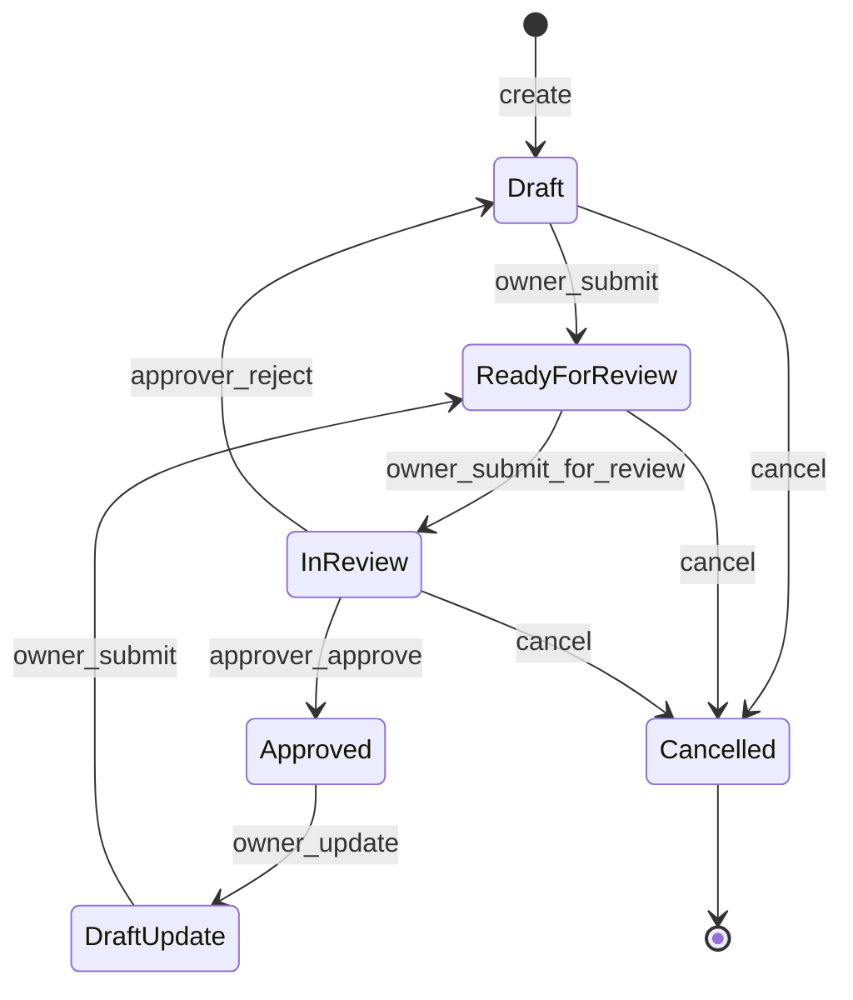
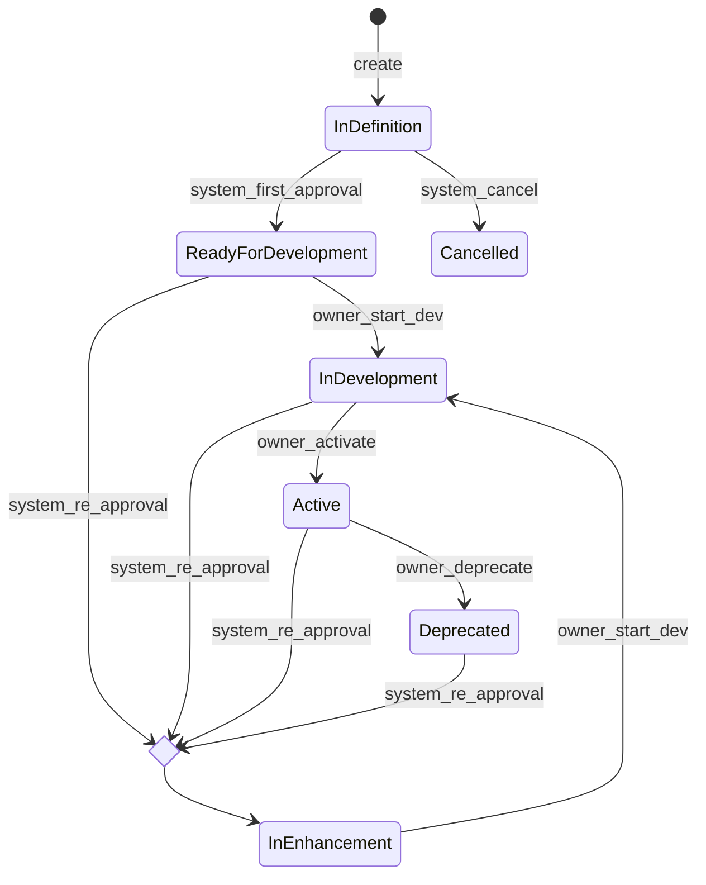
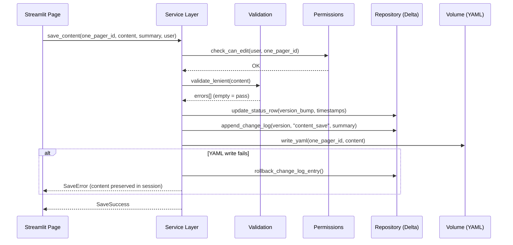
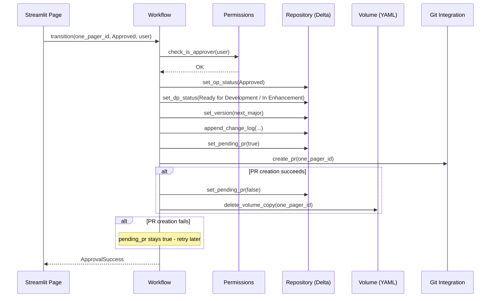

# One Pager Application — Backend / Service Layer Design

## 1. Purpose

This document defines the backend service layer for the One Pager Application: the workflow state machine, validation strategy, permission enforcement, and operational logic that sits between the Streamlit UI and the data/infrastructure layer. It implements the rules defined in [One_Pager_App_Requirements_and_Scope.md](../one-pager/One_Pager_App_Requirements_and_Scope.md) §6 (workflow), §5 (validation), and §2 (permissions).

This layer lives in `onepager_core/` (per [One_Pager_App_Project_Structure.md](One_Pager_App_Project_Structure.md) §2) and has **no Streamlit dependency** — it is pure Python, unit-testable without a UI.

## 2. One Pager Status State Machine



### Transition rules

| From | To | Action | Guard conditions | Side effects |
|---|---|---|---|---|
| (new) | `Draft` | `create` | User is in Owner/SME group | Create YAML, create Delta row, assign OP-ID, append change log ("Initial draft created") |
| `Draft` | `Ready for Review` | `owner_submit` | User is Owner/SME of this DP; **strict validation passes** | Append change log (system-generated). This is a single atomic user action ("Submit for Review") that moves the document directly from `Draft` through to `In Review` — see note below. |
| `Ready for Review` | `In Review` | (automatic, part of `owner_submit`) | — | — |
| `In Review` | `Approved` | `approver_approve` | User is in Approver group; **user is not listed as Owner/SME on this DP** (segregation of duties) | Set version to next MAJOR (or `1.0.0` if first approval); auto-set DP status (`Ready for Development` on first, `In Enhancement` on re-approval); create Git PR; append **two** change log entries (one for OP status, one for DP status) |
| `In Review` | `Draft` | `approver_reject` | User is in Approver group; **user is not listed as Owner/SME on this DP** (segregation of duties); comment is provided (non-empty) | Append change log (includes reviewer's comment); add review comment to `review_comments` table |
| `Approved` | `Draft Update` | `owner_update` | User is Owner/SME of this DP | Read approved YAML from Git, write working copy to volume; version stays at last approved MAJOR until first content save; append change log |
| `Draft Update` | `Ready for Review` | `owner_submit` | User is Owner/SME of this DP; **strict validation passes** | Same atomic behavior — moves through to `In Review` in one step. Append change log. |
| `Draft` / `Ready for Review` / `In Review` | `Cancelled` | `cancel` | User is Owner/SME of this DP **or** user is Admin; DP status is `In Definition` | Set DP status to `Cancelled`; append change log; release any active lock |

> **Submit semantics:** "Submit for Review" is a single user action (one button click) that performs strict validation and, if it passes, moves the document from `Draft` (or `Draft Update`) through `Ready for Review` to `In Review` atomically. Both status updates and their corresponding change log entries are written in a single Delta transaction. If any step fails, the entire operation rolls back — the document is never left stranded in `Ready for Review`. This state exists for audit-trail completeness (visible in the change log) but is not a user-facing resting state.

### Implementation pattern

```python
# onepager_core/workflow.py (conceptual)

class OnePagerWorkflow:
    """Enforces the OP status state machine."""

    TRANSITIONS: dict[tuple[str, str], TransitionRule] = {
        ("Draft", "Ready for Review"): TransitionRule(
            action="owner_submit",
            allowed_roles=["owner_sme"],
            requires_strict_validation=False,
            side_effects=[append_change_log_system],
        ),
        ("Ready for Review", "In Review"): TransitionRule(
            action="owner_submit_for_review",
            allowed_roles=["owner_sme"],
            requires_strict_validation=True,
            side_effects=[append_change_log_system],
        ),
        # ... etc.
    }

    def transition(self, one_pager_id: str, target_status: str, user: AuthenticatedUser, **kwargs):
        current = self.repository.get_status(one_pager_id)
        rule = self.TRANSITIONS.get((current, target_status))
        if rule is None:
            raise InvalidTransitionError(current, target_status)
        rule.check_permission(user, one_pager_id)
        if rule.requires_strict_validation:
            self.validation_service.validate_strict(one_pager_id)
        for effect in rule.side_effects:
            effect(one_pager_id, user, **kwargs)
        self.repository.set_status(one_pager_id, target_status)
```

The `TRANSITIONS` dict is the single source of truth for what's allowed — no transition logic is scattered across pages or UI handlers.

## 3. Data Product Status State Machine



### Transition rules

| From | To | Action | Guard conditions | Side effects |
|---|---|---|---|---|
| `In Definition` | `Ready for Development` | `system_first_approval` | (system-triggered, not user-initiated) | Automatic on first OP approval |
| `In Definition` | `Cancelled` | `system_cancel` | (system-triggered) | Automatic when OP is cancelled |
| any post-approval | `In Enhancement` | `system_re_approval` | (system-triggered) | Automatic on OP re-approval after Draft Update |
| `Ready for Development` | `In Development` | `owner_start_dev` | User is Owner/SME of this DP; OP status is `Approved` | Append change log |
| `In Enhancement` | `In Development` | `owner_start_dev` | User is Owner/SME of this DP; OP status is `Approved` | Append change log |
| `In Development` | `Active` | `owner_activate` | User is Owner/SME of this DP | Append change log |
| `Active` | `Deprecated` | `owner_deprecate` | User is Owner/SME of this DP; confirmation required | Append change log |

System-triggered transitions are called internally by the OP workflow's approval/cancel side effects — they are never exposed as standalone user actions.

## 4. Validation Strategy

Implemented in `onepager_core/validation.py`. Two tiers, as defined in requirements doc §5:

### Lenient (Save as Draft)
- Only `productName` and `description` must be non-empty.
- All other fields may be null/empty/missing.
- Called on every content save while in `Draft` or `Draft Update`.

### Strict (Submit for Review)
- The full document must pass `jsonschema.validate()` against the schema version declared in `structure_definition`.
- All `required` fields and `minItems` constraints are enforced.
- Conditional business rules are checked:
  - `retentionRequirements` must not be empty/null when `containsPII` or `containsSensitiveData` is true, or when `classificationLevel` is not `Public`.
  - `cdeCriticalityTiering` and `useCaseLinks` must be null when `isCriticalDataElement` is false.
- Called as a guard condition on the `Ready for Review → In Review` transition.

### Validation error reporting
Errors are returned as a structured list of `ValidationError(field_path, message)` objects — not raised as exceptions. The UI can display them inline next to the relevant field/section. The transition is blocked only if the list is non-empty.

## 5. Permission Enforcement

Implemented in `onepagerapp/permissions.py` (with `auth.py` for identity and roles). Every service-layer method that modifies data checks permissions before proceeding.

### Permission model

| Check | How it works |
|---|---|
| **Is the user authenticated and recognised?** | The username comes from the Databricks Apps proxy headers. `auth.py` derives the corporate initials using the configured domains, suffixes and initials pattern (Architecture §4). No username, or a username that does not match → no initials → access refused before any page runs. Every service method also refuses a user without initials. |
| **Coarse role** (Owner/SME group, Approver, Admin, Viewer) | Once per session, one SQL statement run **as the user** checks the configured role groups: `is_account_group_member(:g) OR is_member(:g)` for `ONE_PAGER_APP_GROUP_OWNER_SME`, `…_APPROVER`, `…_ADMIN` (interim default for all three: `BEC_BECOC001_LHX_{env}_DataPlatEng`). `auth.resolve_roles` maps them to `Actor.OWNER_SME_GROUP`, `Actor.APPROVER` and `Actor.ADMIN`; stored in the session; no group → Viewer; a failed check → Viewer (fail closed). Services that need a role take the session's `roles`. |
| **Per-Data-Product ownership** | The user's corporate initials (`CurrentUser.initials`, resolved once per session) are looked up in `one_pager_authorized_users` for the target One Pager: `owner` or `sme` (`Actor.OWNER_SME`). This table is kept in sync with the One Pager YAML content and provides O(1) permission verification. |

### Data access identity

Reads run with the user's token; writes (and reads that are part of a write, such as the ID-sequence compare-and-set and the lock checks) run as the app's service principal (Architecture §8, Decision_Log §19). The connection makes the choice explicit on every statement (`identity=USER` / `APP`), and a test fails if a write statement is sent as the user. Because writes run as the service principal, **every write carries the acting user's initials** in the table's audit column or in the change-log entry of the same operation.

A permission error on a **read** means the user's groups lack a grant: the user sees "Your role does not have access to … Contact the platform team." A permission error on a **write** means the service principal lacks a grant: it is logged as a deployment error and the user sees a generic error.

### Permission matrix (enforcement points)

| Operation | Required role | Additional per-record check |
|---|---|---|
| View any One Pager | Any authenticated user | None |
| Create new One Pager | Owner/SME group member | None (document doesn't exist yet) |
| Edit One Pager (save content) | — | User initials ∈ {owner, smes} of this DP, and status Draft / Draft Update |
| Submit for review | — | User initials ∈ {owner, smes} of this DP |
| Approve / Reject | Approver group member | User initials ∉ {owner, smes} of this DP (segregation of duties — cannot approve/reject own OP) |
| Cancel (OP in Draft/Ready for Review/In Review) | Owner/SME of this DP **or** Admin | Owner: initials check; Admin: group check |
| Change DP status (owner-initiated transitions) | — | User initials ∈ {owner, smes} of this DP |
| Manage Use Cases (create/edit/deprecate/restore) | Owner/SME group member | None (Use Cases are shared, any Owner/SME group member can manage) |
| Admin actions (manage reference data, cancel any) | Admin group member | None |

"Group" means the Entra ID role group configured for the role (Architecture §4). Role membership is managed in Entra ID, not in the app. The Owner/SME **group** is only needed to create One Pagers and manage Use Cases; working on an existing One Pager depends only on being listed as its Owner or SME, so a business Owner or SME listed on a One Pager can edit it without being in the group. Every service entry point first refuses a user without initials (`permissions.require_identity`).

### Enforcement pattern

```python
# onepagerapp/workflow.py (simplified)

def create_one_pager(data, user, data_access, document_store, now=None, *, roles):
    require_identity(user, "create_one_pager")          # recognised user
    if not can_create_one_pager(user, roles):           # Owner/SME group role
        log_permission_denied("create_one_pager", user=user.initials)
        raise PermissionDeniedError("You are not allowed to create One Pagers.")
    ...

# onepagerapp/editing.py (simplified)

def save_draft(data_access, ..., one_pager_id, ..., user, ...):
    require_identity(user, "save_draft", one_pager_id)
    authorized = data_access.get_authorized_users(one_pager_id)
    check_can_edit(user, one_pager_id, row.one_pager_status, authorized)  # per record
    ...
```

The pages call the same functions (`can_create_one_pager`, `get_action_states`, …) to hide or disable buttons, but **hiding a button is never the sole enforcement** — the service layer always re-checks.

## 6. Locking

Implemented in `onepager_core/locking.py` (dedicated module).

### Acquire lock
1. Check if an active (non-expired) lock exists for this `one_pager_id`.
2. If no lock exists → create one with `locked_by_initials`, `session_id`, `acquired_at`, `last_heartbeat = now()`, `expires_at = now() + 30min`.
3. If a lock exists **by the same user and same session** → reuse it (heartbeat is refreshed on next re-run).
4. If a lock exists **by the same user but different session** → warn: "You have this document open in another tab."
5. If a lock exists **by a different user** and is not expired → reject: "Locked by {name} since {time}."
6. If a lock exists **by a different user** but is expired → overwrite it (the previous session abandoned it). Log a security event (lock override).

### Heartbeat
On every Streamlit re-run while the editor is active, `last_heartbeat` and `expires_at` are updated. This is called by the presentation layer (`state.py`) as part of the page re-run lifecycle.

If the Streamlit process dies or the user closes the browser tab, no heartbeat occurs and the lock auto-expires after 30 minutes — no explicit cleanup is needed.

### Release
Lock is released (row deleted) on **session-ending actions only**:
- Submit for review (the atomic submit action)
- Cancel (exit editor without saving, discarding changes)
- Manual release from the Preview page (only the lock holder can release their own lock — permission check: `locked_by_initials == user.initials`)

**Intermediate saves do not release the lock** — the user remains in the editor with their lock active. The heartbeat continues refreshing on each re-run.

### Lock on `owner_update` (Approved → Draft Update)
When the Owner triggers "Update," the system reads the approved YAML from Git, writes it to the volume, and transitions to `Draft Update`. A lock is **not** automatically acquired at this point — the lock is acquired when the user subsequently enters the editor page. This avoids orphaned locks if the Owner triggers "Update" but doesn't immediately start editing.

## 7. Content Save Flow (end-to-end)



## 8. Approval Flow (end-to-end)



## 9. Use Case Service

Use Cases are a shared registry managed via `onepager_core/repository.py`.

### Operations

| Operation | Permission | Logic |
|---|---|---|
| `create_use_case(persona, goal, scenario, decision_enabled, priority, user)` | User is in Owner/SME group | Generate UC-### ID, insert row into `use_cases`, return the new ID. |
| `edit_use_case(use_case_id, fields, user)` | User is in Owner/SME group | Update the row; set `last_updated_by`, `last_updated_at`. |
| `deprecate_use_case(use_case_id, user)` | User is in Owner/SME group | Set `deprecated = true`. The Use Case remains in the table and in any referencing One Pagers — it simply can't be linked to new One Pagers. |
| `link_use_case(one_pager_id, use_case_id, user)` | User is Owner/SME of this DP | Insert row into `use_case_references`. Use Case must not be deprecated. |
| `unlink_use_case(one_pager_id, use_case_id, user)` | User is Owner/SME of this DP | Delete row from `use_case_references`. |

Any Owner/SME can create/edit/deprecate any Use Case (they are a shared resource, not owned per Data Product). Linking/unlinking a Use Case to a specific One Pager requires per-DP ownership of that One Pager.

## 10. PDF Export Service

Implemented in `onepagerapp/export.py`, rendered by the dependency-free PDF writer `onepagerapp/pdf.py` ([Decision_Log.md](Decision_Log.md) §18).

### Flow
1. Determine which copy of the document to read:
   - If OP status is `Approved` and no volume copy exists → read from Git `main` (with the Git integration, Phase 8).
   - Otherwise → read from the UC volume. Until the Git integration exists, the current version is always read from the volume.
2. Resolve Use Case references: join UC IDs from the YAML against the `use_cases` Delta table to get full content.
3. Render the complete One Pager (all sections, then the change log) into an A4 PDF.
4. Return the PDF bytes to the UI for download (`<OP-ID>_v<version>.pdf`). Each export is logged as an `export_pdf` security event.

No special permissions beyond authentication — any user who can view a One Pager can export it to PDF (consistent with universal read access).

## 11. Owner/SME List Changes

Editing `dataProductOwner` or `smes` is handled as a **regular content save** (part of the YAML edit). The permission check happens against the **current** owner/SME list at the time of save — meaning:

- The current Owner can add or replace SMEs.
- The current Owner can replace themselves with a new Owner (the save succeeds because the check uses the list **before** the edit, not after).
- After a save that removes the current user from the owner/SME list, the user **immediately loses edit access** on the next operation. Their current editing session is not forcibly terminated (they can finish viewing), but subsequent save attempts will be rejected.
- If the last remaining Owner/SME needs to be replaced entirely (e.g. handover), Admin involvement is not required — the current Owner can save the change themselves.

This is logged in the change log like any other content save (with the Owner's summary describing the change).

### Sync with `one_pager_authorized_users` table

Whenever a One Pager is saved, the app automatically syncs the `one_pager_authorized_users` table to match the current `dataProductOwner` and `smes` arrays in the One Pager YAML:

1. Extract the `dataProductOwner` and `smes` from the saved YAML.
2. Query the current contents of `one_pager_authorized_users` for this `one_pager_id`.
3. **Insert new users** from the YAML who aren't in the table (both owners and SMEs).
4. **Update existing users** if their name, email, or team changed.
5. **Delete users** from the table who are no longer in the YAML (they have been removed as Owner or SMEs).

This ensures the `one_pager_authorized_users` table is always the authoritative reflection of who can edit the One Pager, enabling fast O(1) permission checks on every edit/action.

## 13. Review Comment Lifecycle

- **On rejection (`In Review → Draft`):** The Approver's comment is stored in `review_comments` with `resolved = false`. Old comments from prior rejection cycles (if any) are **preserved** — they are not deleted or reset.
- **On re-edit and re-submission:** The Owner can view all review comments (current and prior cycles) and mark individual comments as `resolved`. The `resolved_by` and `resolved_at` fields are set at that point.
- **On re-review:** The Approver sees all comments — both unresolved (needing attention) and resolved (addressed by the Owner). This gives the Approver visibility into what was fixed and what was previously raised.
- **Comments are never deleted** — they form part of the audit trail.

## 14. Help Page Data

The Help page reads data from:
- `ref_op_status` and `ref_dp_status` tables (display labels, ordering, colors) for rendering lifecycle diagrams and status badges.
- The valid-combinations table and transition rules are currently code-defined (in `workflow.py`'s `TRANSITIONS` dict). The Help page renders these by calling a service method that returns a serialized list of transitions and valid pairs — it does not query a separate reference table for them.

If transition rules are later moved to a data-driven reference table (data model open item #4), the Help page would read from that table instead.

## 14. Module Responsibility Summary

| Module | Responsibility |
|---|---|
| `workflow.py` | OP and DP status state machines; transition validation; orchestrates side effects |
| `validation.py` | Lenient/strict content validation against JSON Schema + business rules |
| `permissions.py` | Role resolution, per-record ownership checks, permission enforcement |
| `repository.py` | All Delta CRUD: status, change log, reviews, use cases, use case references, ID sequences |
| `locking.py` | Pessimistic lock acquire/heartbeat/release logic |
| `volume.py` | YAML file read/write on the UC external volume |
| `git_integration.py` | Create PR on approval; check pending-PR status; retry failed PRs |
| `id_generator.py` | Atomic ID generation for OP/UC/BR |
| `use_cases.py` | Use Case input rules and the Use Case write services (permission check, write, security event) |
| `auth.py` | Extract corporate initials from the Databricks username (configurable domains, suffixes, initials pattern); build the current user with the display name from the directory (SCIM `Me`); resolve role-group membership |
| `config.py` | Read runtime env vars (catalog, schema, volume path, secret scope) |
| `audit.py` | Structured security-event logging (one event per write, with the user's initials) |
| `export.py` | PDF export rendering |
| `models.py` | Pydantic/dataclass models for typed access to One Pager sections |

## 15. Open Items

| # | Item | Notes |
|---|---|---|
| 1 | Retry mechanism for pending Git PRs | Scheduled job vs. on-next-access check — to be decided during implementation. |
| 2 | Use Case edit permissions scope | Currently "any Owner/SME can manage any Use Case." Should editing a Use Case require being an Owner/SME of a Data Product that references it? |
| 3 | Notification triggers (future) | When notifications are implemented, the workflow side effects are the natural hook points. |
