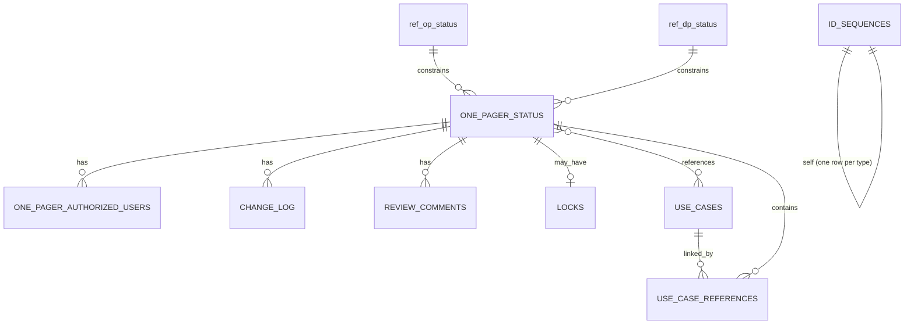

# One Pager Application — Data Model

## 1. Purpose

This document defines the Delta table schemas, ID generation strategy, and schema evolution approach for the One Pager Application. It maps the business data model (defined in `structure_one_pager_v_1.json`) onto the storage architecture decided in [One_Pager_App_Architecture.md](One_Pager_App_Architecture.md) §5.

Recap of the storage split:
- **One Pager document content** → YAML files in a UC external volume (pre-approval) / Git (post-approval).
- **Everything else** (operational/application data) → Delta tables in Unity Catalog.

All tables use Delta in the current phase. Several tables are identified as Lakebase migration candidates — see architecture doc §5 for the rationale and migration path.

This document covers the Delta tables only. The YAML file structure is defined by the JSON Schema and the volume layout in [Architecture.md](Architecture.md) §5, "Volume file layout".

## 2. Table Overview

| Table | Purpose |
|---|---|
| `one_pager_status` | Master record per One Pager — status, owner, metadata, version (one row per Data Product) |
| `one_pager_authorized_users` | Authorized users (Data Product Owner and assigned SMEs) per One Pager — denormalized for fast permission verification on every edit/action |
| `change_log` | Immutable append-only audit trail of all changes and status transitions |
| `review_comments` | Section-level review comments from Approvers |
| `locks` | Pessimistic edit locks (one active lock per One Pager at most) |
| `use_cases` | Shared Use Case registry (single source of truth for all use case content) |
| `use_case_references` | Junction table: which One Pagers reference which Use Cases |
| `id_sequences` | Auto-incrementing counters for OP-####, UC-###, BR-### |
| `ref_op_status` | Reference/lookup: valid One Pager status values + display metadata |
| `ref_dp_status` | Reference/lookup: valid Data Product status values + display metadata |
| `ref_business_domains` | Admin-managed reference data: valid business domain values |
| `ref_data_product_types` | Admin-managed reference data: valid data product type values |
| `ref_source_systems` | Admin-managed reference data: known source systems |

## 3. Table Definitions

### `one_pager_status`

The authoritative record of each One Pager's current state. One row per Data Product (1:1 relationship).

| Column | Type | Nullable | Description |
|---|---|---|---|
| `one_pager_id` | STRING | No | PK. Auto-generated `OP-####`. |
| `data_product` | STRING | No | Unique key — registered name of the Data Product (matches YAML `dataProduct` field). |
| `product_name` | STRING | No | Human-readable name. |
| `business_domain` | STRING | No | Business domain. |
| `data_product_type` | STRING | No | `Foundational` / `Integrated` / `Augmented`. |
| `one_pager_status` | STRING | No | Current document lifecycle status (enum). |
| `data_product_status` | STRING | No | Current product lifecycle status (enum). |
| `version` | STRING | No | Current MAJOR.MINOR.PATCH version. |
| `owner_name` | STRING | No | Data Product Owner display name. |
| `owner_initials` | STRING | No | Owner initials (authorization key). |
| `owner_email` | STRING | No | Owner email (display). |
| `owner_team` | STRING | Yes | Owner team. |
| `created_by` | STRING | No | Initials of the user who created this record. |
| `created_at` | TIMESTAMP | No | Creation timestamp. |
| `last_updated_at` | TIMESTAMP | No | Last modification timestamp. |
| `last_updated_by` | STRING | No | Initials of the user who last modified. |
| `reviewed_at` | TIMESTAMP | Yes | Timestamp of last review decision. |
| `reviewed_by` | STRING | Yes | Initials of the reviewer. |
| `structure_definition` | STRING | No | Schema version this document follows (e.g. `structure_one_pager_v_1.json`, a file name in `schemas/` — see [Decision_Log.md](Decision_Log.md) §12). |
| `pending_pr` | BOOLEAN | No | `true` if approval happened but Git PR creation has not yet succeeded (retry flag, per architecture doc §7). Default `false`. |

**Indexes / constraints:**
- **PK (Primary Key):** `one_pager_id` — Immutable, auto-generated (`OP-0001`, `OP-0002`, etc.). Never changes across the One Pager's lifetime.
- **Unique:** `data_product` — Unique registered name, but **not** a candidate key for the table. Data product names can be renamed (see [Architecture.md](Architecture.md) §5 and [Decision_Log.md](Decision_Log.md) §6), so they cannot serve as a stable primary key. Each One Pager is uniquely identified by its immutable `one_pager_id`.

> **Delta constraint note:** Delta Lake does not physically enforce primary key, foreign key, or unique constraints at the storage layer. The constraints listed throughout this document are logical — they must be enforced by the application layer (domain/service code) and are documented here for schema clarity and future migration compatibility.

### `one_pager_authorized_users`

All authorized users (Data Product Owner and assigned SMEs) per One Pager. Denormalized from the One Pager YAML content for fast permission verification on every edit/action. Kept in sync with the One Pager document — whenever a user is removed from the `smes` section in the One Pager YAML, this table is updated to reflect the change.

| Column | Type | Nullable | Description |
|---|---|---|---|
| `one_pager_id` | STRING | No | FK → `one_pager_status.one_pager_id`. |
| `user_initials` | STRING | No | User initials (authorization key). |
| `user_name` | STRING | No | User display name. |
| `user_email` | STRING | No | User email (display). |
| `user_team` | STRING | Yes | User team. |
| `role` | STRING | No | `owner` or `sme` — denotes whether this user is the Data Product Owner or an assigned SME. |

**Indexes / constraints:**
- Composite PK: (`one_pager_id`, `user_initials`)
- The Data Product Owner's `role` is always `owner` (one per One Pager).
- SMEs have `role = sme` (zero or more per One Pager).

**Sync mechanism:**
- On **initial creation**, the app populates this table from the document: the `dataProductOwner` is inserted as `owner` and each entry of `smes` as `sme`. The creator is **not** inserted automatically; validation requires the creator to be listed as the Owner or an SME ([Decision_Log.md](Decision_Log.md) §9). These rows are written before the `one_pager_status` row, so permission checks work as soon as the One Pager is visible ([Decision_Log.md](Decision_Log.md) §11).
- On **subsequent saves**, the app compares the `dataProductOwner` and `smes` arrays in the YAML against the current contents of `one_pager_authorized_users` and updates this table to match (insert new users, delete removed users).
- This ensures the table is always consistent with the authoritative One Pager document.

### `change_log`

Immutable, append-only. One row per event (content save, status transition, creation, cancellation).

| Column | Type | Nullable | Description |
|---|---|---|---|
| `id` | BIGINT | No | PK. Delta generated identity column (`GENERATED ALWAYS AS IDENTITY`). |
| `one_pager_id` | STRING | No | FK → `one_pager_status.one_pager_id`. |
| `version` | STRING | No | Document version at the time of this entry. |
| `event_type` | STRING | No | `content_save` / `status_transition` / `creation` / `cancellation`. |
| `author_initials` | STRING | No | User who performed the action. |
| `author_name` | STRING | No | Display name. |
| `summary` | STRING | No | Human-readable description (owner-authored for saves, system-generated for transitions). |
| `from_status` | STRING | Yes | Previous status (for `status_transition` events). |
| `to_status` | STRING | Yes | New status (for `status_transition` events). |
| `status_field` | STRING | Yes | Which status changed: `one_pager_status` or `data_product_status`. |
| `created_at` | TIMESTAMP | No | When this entry was recorded. |

### `review_comments`

Section-level comments added by Approvers during review.

| Column | Type | Nullable | Description |
|---|---|---|---|
| `id` | BIGINT | No | PK. Delta generated identity column (`GENERATED ALWAYS AS IDENTITY`). |
| `one_pager_id` | STRING | No | FK → `one_pager_status.one_pager_id`. |
| `version` | STRING | No | Document version at the time the comment was added. |
| `section` | STRING | Yes | Which section the comment applies to (matches a top-level JSON Schema property name, e.g. `businessProblemStatement`, `useCases`, `dataClassification`). `NULL` for document-level comments not tied to a specific section (e.g. rejection comments). |
| `reviewer_initials` | STRING | No | Who wrote the comment. |
| `reviewer_name` | STRING | No | Display name. |
| `comment` | STRING | No | The comment text. |
| `resolved` | BOOLEAN | No | Whether the Owner has marked this comment as addressed. Default `false`. |
| `resolved_by` | STRING | Yes | Initials of the user who resolved the comment. |
| `created_at` | TIMESTAMP | No | When the comment was added. |
| `resolved_at` | TIMESTAMP | Yes | When the comment was marked resolved. |

### `locks`

At most one active (non-expired) row per One Pager at any time.

| Column | Type | Nullable | Description |
|---|---|---|---|
| `one_pager_id` | STRING | No | FK → `one_pager_status.one_pager_id`. |
| `locked_by_initials` | STRING | No | User holding the lock. |
| `locked_by_name` | STRING | No | Display name. |
| `session_id` | STRING | No | Streamlit session hash — used to distinguish multiple browser tabs opened by the same user (multi-tab detection per architecture doc §3). |
| `acquired_at` | TIMESTAMP | No | When the lock was acquired. |
| `last_heartbeat` | TIMESTAMP | No | Updated on every Streamlit re-run while the user is editing (per architecture doc §3). |
| `expires_at` | TIMESTAMP | No | `last_heartbeat + 30 minutes`. Lock is considered expired if `now() > expires_at`. |

**Indexes / constraints:**
- PK: `one_pager_id` (only one lock row per One Pager; acquiring a new lock replaces/overwrites the expired one).

> **Maintenance note:** Heartbeat UPDATEs on every Streamlit re-run cause Delta small-file accumulation. Schedule periodic `OPTIMIZE` on this table (e.g., hourly or daily via a Databricks job).

### `use_cases`

Shared Use Case registry — single source of truth for all use case content.

| Column | Type | Nullable | Description |
|---|---|---|---|
| `use_case_id` | STRING | No | PK. Auto-generated `UC-###`. |
| `persona` | STRING | No | Role or job title of the consumer. |
| `goal` | STRING | No | What the persona wants to achieve. |
| `scenario` | STRING | No | How they use the data product. |
| `decision_enabled` | STRING | No | What decision/action this makes possible. |
| `priority` | STRING | No | `Must Have` / `High` / `Medium` / `Low`. |
| `deprecated` | BOOLEAN | No | Soft-delete flag (cannot hard-delete because other One Pagers may reference it). Default `false`. |
| `created_by` | STRING | No | Initials of the user who created this use case. |
| `created_at` | TIMESTAMP | No | Creation timestamp. |
| `last_updated_by` | STRING | No | Initials of the last editor. |
| `last_updated_at` | TIMESTAMP | No | Last modification timestamp. |

### `use_case_references`

Junction table linking One Pagers to the Use Cases they reference.

| Column | Type | Nullable | Description |
|---|---|---|---|
| `one_pager_id` | STRING | No | FK → `one_pager_status.one_pager_id`. |
| `use_case_id` | STRING | No | FK → `use_cases.use_case_id`. |

**Indexes / constraints:**
- Composite PK: (`one_pager_id`, `use_case_id`)

### `id_sequences`

One row per ID type. The app reads and increments the counter atomically when generating a new ID.

| Column | Type | Nullable | Description |
|---|---|---|---|
| `id_type` | STRING | No | PK. `OP` / `UC` / `BR`. |
| `last_value` | INT | No | The last assigned numeric value. Next ID = `last_value + 1`. |

**Seed data (Liquibase):**
| `id_type` | `last_value` |
|---|---|
| `OP` | 0 |
| `UC` | 0 |
| `BR` | 0 |

### `ref_op_status`

Reference/lookup table for valid One Pager status values. Populated by Liquibase seed data; read by the UI for dropdowns, badges, and the Help page.

| Column | Type | Nullable | Description |
|---|---|---|---|
| `status` | STRING | No | PK. The status value (must match the JSON Schema enum). |
| `display_label` | STRING | No | Label shown in the UI. |
| `sort_order` | INT | No | Display ordering in dropdowns/filters. |
| `badge_color` | STRING | Yes | Hex color for status badges (e.g. `#65B676` for Approved). |
| `is_terminal` | BOOLEAN | No | Whether this is an end state with no outgoing transitions. |

**Seed data:**
| `status` | `display_label` | `sort_order` | `badge_color` | `is_terminal` |
|---|---|---|---|---|
| `Draft` | Draft | 1 | `#808080` | false |
| `Ready for Review` | Ready for Review | 2 | `#F9BD00` | false |
| `In Review` | In Review | 3 | `#F9BD00` | false |
| `Approved` | Approved | 4 | `#65B676` | false |
| `Draft Update` | Draft Update | 5 | `#808080` | false |
| `Cancelled` | Cancelled | 6 | `#F34421` | true |

### `ref_dp_status`

Reference/lookup table for valid Data Product status values.

| Column | Type | Nullable | Description |
|---|---|---|---|
| `status` | STRING | No | PK. The status value (must match the JSON Schema enum). |
| `display_label` | STRING | No | Label shown in the UI. |
| `sort_order` | INT | No | Display ordering in dropdowns/filters. |
| `badge_color` | STRING | Yes | Hex color for status badges. |
| `is_terminal` | BOOLEAN | No | Whether this is an end state with no outgoing transitions. |

**Seed data:**
| `status` | `display_label` | `sort_order` | `badge_color` | `is_terminal` |
|---|---|---|---|---|
| `In Definition` | In Definition | 1 | `#808080` | false |
| `Ready for Development` | Ready for Development | 2 | `#65B676` | false |
| `In Development` | In Development | 3 | `#3599B8` | false |
| `Active` | Active | 4 | `#00975f` | false |
| `In Enhancement` | In Enhancement | 5 | `#F9BD00` | false |
| `Deprecated` | Deprecated | 6 | `#808080` | true |
| `Cancelled` | Cancelled | 7 | `#F34421` | true |

## 4. ID Generation

| ID | Format | Pattern | Generation |
|---|---|---|---|
| One Pager ID | `OP-####` | 4-digit zero-padded | Atomically increment `id_sequences` row where `id_type = 'OP'`, format as `OP-{value:04d}`. |
| Use Case ID | `UC-###` | 3-digit zero-padded | Same pattern, `id_type = 'UC'`. |
| Business Req ID | `BR-###` | 3-digit zero-padded | Same pattern, `id_type = 'BR'`. |

Atomic increment uses compare-and-set, because Delta has no `UPDATE ... RETURNING`: read `last_value`, then `UPDATE id_sequences SET last_value = :new WHERE id_type = :type AND last_value = :expected`. The increment succeeded only if the UPDATE reports `num_affected_rows = 1` (a re-read is not sufficient — another writer may have advanced the counter to the same value). On 0 affected rows or a Delta concurrent-modification error, `id_generator.py` retries the whole cycle (up to 5 attempts). This is sufficient at the expected scale (dozens/hundreds of One Pagers, not thousands created per minute).

**Note on BR-### global uniqueness:** Requirements doc §14 states BR IDs are "unique within a One Pager," but the shared `id_sequences` counter makes them globally unique — a stronger guarantee. This is intentional: it simplifies cross-referencing and avoids collision if Business Requirements are ever shared across One Pagers in the future.

**Note on overflow:** `OP-####` allows up to 9999 One Pagers; `UC-###` / `BR-###` allow up to 999 each. If the registry approaches these limits, the format can be extended (e.g. `OP-#####`) — this is a schema evolution concern tracked as an open item.

## 5. Relationship Between YAML and Delta

The One Pager's **content** (business problem, requirements, data sources, data element preview, governance artifacts, etc.) lives exclusively in the YAML file. The Delta `one_pager_status` table stores only **metadata and status** needed for:
- Browsing/filtering (product name, domain, type, statuses, owner)
- Workflow enforcement (current statuses, pending PR flag)
- Authorization (owner/SME initials)
- Audit (version, timestamps, who last updated)

When the Owner saves content changes via the editor:
1. The domain layer validates the content.
2. The Delta `one_pager_status` row is updated (version bump, `last_updated_at`, `last_updated_by`) and a `change_log` row is appended. **Delta is written first** because it is the system-of-record for status/changelog.
3. The YAML file is written to the UC volume (or updated in place).
4. If the YAML write fails, the Delta change is rolled back (or marked as failed) and the user sees an error. Their content remains in `st.session_state` and is not lost.

See architecture doc §7 for the full error-handling strategy.

### Source-of-truth resolution
- **Business content fields** (description, business problem, data sources, data element preview, governance artifacts, owner/SME identity) **in the YAML** are the authoritative source. The Delta `one_pager_status` columns for content-derived fields (`product_name`, `business_domain`, `data_product_type`, `owner_*`) are a **denormalized cache** updated on every save.
- **Operational metadata** (statuses, version, timestamps, change log) **in Delta** is the authoritative source. The corresponding YAML fields (`onePagerStatus`, `dataProductStatus`, `version`, `lastUpdated`, `changeLog`) are populated as denormalized copies on every save so the YAML file remains self-contained for Git archival and PDF export.
- If a discrepancy is ever detected: Delta is trusted for operational metadata (statuses, version, timestamps), YAML is trusted for business content.
- **Audit fields in Delta** (`created_by`, `last_updated_by`, `reviewed_by`) store user **initials** (the authorization key). The corresponding YAML fields (`createdBy`, `reviewedBy`) store **display names**. This is intentional — Delta is optimized for authorization lookups, YAML for human readability.
- **Initials are corporate initials** (e.g. `X0W`), derived from the username (Architecture §4). They are upper case and may contain digits; the valid pattern is a setting (`ONE_PAGER_APP_INITIALS_PATTERN`, default `^[A-Z0-9]{2,5}$`).
- **Who wrote a row.** All writes run as the app's service principal (Architecture §8), so Delta history (`DESCRIBE HISTORY`) shows the service principal, not the person. The audit columns above, `change_log.author_initials`, `review_comments.reviewer_initials` / `resolved_by` and `locks.locked_by_initials` are the record of who made a change. `one_pager_authorized_users` and `use_case_references` have no actor column; their changes are covered by the `change_log` entry of the same save.

**Use Cases** are stored in the Delta `use_cases` table (not in the YAML). The YAML's `useCases` array stores only Use Case IDs (references). When the app reads a One Pager for display, it resolves the full Use Case content by joining against the `use_cases` table.

**Business Requirements** (BR-###) use the global `id_sequences` counter for ID generation but their content lives entirely in the YAML — there is no corresponding Delta table, since BRs are per-OP content and are not shared across One Pagers. If a YAML write fails after the BR counter is incremented, the ID is consumed (creating a gap in the sequence); ID gaps are harmless and expected.

> **Note — JSON Schema alignment:** `structure_one_pager_v_1.json` defines `useCases` items as full objects (with `persona`, `goal`, etc.). `structure_one_pager_v_2.json` (the current version) stores only `useCaseId` references, which the app resolves against the `use_cases` table for display. See Decision_Log §14.

## 6. Schema Evolution

The `structure_definition` field on each One Pager records which schema version it was written against (e.g. `structure_one_pager_v_1.json`). This enables future schema evolution:

- When a `v2` schema is introduced, existing documents remain valid against `v1` until explicitly migrated.
- The app validates each document against the schema version declared in its own `structure_definition` field, not against a single hardcoded schema.
- Migration from `v1` to `v2` can be done as a batch operation or lazily (on next edit), depending on the nature of the change.
- The `schemas/` directory in the app repo holds all supported schema versions; older versions are not removed.

`structure_one_pager_v_2.json` is the current version (Decision_Log §14). The supported versions are listed in `SUPPORTED_STRUCTURE_DEFINITIONS` in `validation.py`; a document declaring any other value fails validation. v1 documents are migrated lazily, on their next save.

## 7. Version History *(future scope)*

Viewing and comparing past versions of a One Pager is deferred to a future release. The storage mechanism for version snapshots (full-document snapshot table vs. Git history vs. Delta time travel) will be decided when this feature is scheduled.

The current change log (§3 `change_log` table) provides a summary-level history (who changed what and when) but does not store full document content at each version.

### Admin-managed reference tables

The following three tables store reference data managed by the Admin via the Admin page. They drive dropdown options in the Editor and filter options in the Registry. Seeded via Liquibase with initial values; Admin can add/edit/deactivate entries at runtime.

#### `ref_business_domains`

| Column | Type | Nullable | Description |
|---|---|---|---|
| `domain` | STRING | No | PK. Domain name (e.g. `Core Banking`, `Payments`). |
| `sort_order` | INT | No | Display ordering. |
| `active` | BOOLEAN | No | Whether this domain is available for new One Pagers. Default `true`. |

#### `ref_data_product_types`

| Column | Type | Nullable | Description |
|---|---|---|---|
| `type` | STRING | No | PK. Product type (e.g. `Foundational`, `Integrated`, `Augmented`). |
| `sort_order` | INT | No | Display ordering. |
| `active` | BOOLEAN | No | Default `true`. |

#### `ref_source_systems`

| Column | Type | Nullable | Description |
|---|---|---|---|
| `system_name` | STRING | No | PK. Source system name. |

Created by the Liquibase changeset `ddl/ref_source_systems.sql`.
| `sort_order` | INT | No | Display ordering. |
| `active` | BOOLEAN | No | Default `true`. |

## 8. Open Items

| # | Item | Notes |
|---|---|---|
| 1 | ID format overflow strategy | What happens when OP reaches 9999 or UC/BR reaches 999. |
| 2 | Version history storage mechanism | Deferred to future scope — full-doc snapshots vs. Git history vs. Delta time travel. |
| 3 | `section` values for review comments | Now nullable — `NULL` means a document-level comment (e.g. Approver rejection comment). Section-level comments use top-level JSON Schema property names; confirm this granularity is correct for the UI. |
| 4 | Valid-transitions / valid-combinations reference table | Currently transition rules are enforced in code only. Consider storing them as data (enabling Help page rendering and possible Admin management). |
| 5 | ~~Admin-managed reference data tables~~ | **Resolved:** three reference tables added (`ref_business_domains`, `ref_data_product_types`, `ref_source_systems`). Managed in-app via the Admin page. See §3. |
| 6 | ~~JSON Schema `useCases` update to ID-only format~~ | **Resolved:** the JSON Schema continues to define `useCases` items as full objects (representing the logical/display view). The physical YAML file written by the app stores only `useCaseId` string references in this array. Validation of the `useCases` section is handled by the application layer (not raw `jsonschema` against the full-object definition). A formal schema annotation or `v1.1` update is deferred to the schema evolution cycle — the app layer handles the mismatch cleanly in the meantime. This must be addressed before E2-1 (data models) and E2-2 (validation) implementation. |
| 7 | Actor columns on reference tables | The `ref_*` tables have no "changed by" column, and writes run as the service principal, so Admin changes to reference data are recorded only in the security-event log. Decide whether to add `last_updated_by` / `last_updated_at` (Liquibase change). See `..dev/User_Identity_And_Access_Plan.md` Phase 3. |
