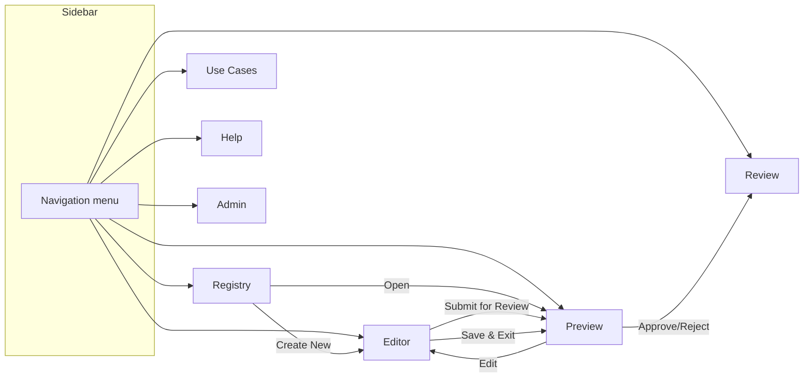

# One Pager Application — UI Design

## 1. Purpose

This document defines the screen inventory, navigation, layout, component structure, states, theming, and accessibility requirements for the One Pager Application's Streamlit UI. It is the blueprint for developers implementing the pages defined in [One_Pager_App_Project_Structure.md](One_Pager_App_Project_Structure.md) §2.

## 2. Navigation Structure



### Sidebar
- BEC logo at the top
- Current user identity (name/initials + role badge)
- Environment badge (DEV / INT / UAT / PRD) — always visible so testers never confuse environments
- Navigation links: Registry, Editor, Review (visible to Approvers), Preview, Use Cases, Help, Admin (visible to Admins)
- The Editor is always registered (Streamlit 1.38 cannot hide a single page and `st.switch_page` needs registered pages). Opened without an edit/create intent, it shows "Start from the Registry (➕ New) or from a One Pager's Edit action" and a button back to the Registry.
- Active page highlighted

### Page visibility by role

| Page | Owner/SME | Approver | Admin | Viewer |
|---|:---:|:---:|:---:|:---:|
| Registry | ✅ | ✅ | ✅ | ✅ |
| Editor | ✅ (own DPs only) | — | — | — |
| Review | — | ✅ | — | — |
| Preview | ✅ | ✅ | ✅ | ✅ |
| Use Cases | ✅ | ✅ (read-only) | ✅ (read-only) | ✅ (read-only) |
| Help | ✅ | ✅ | ✅ | ✅ |
| Admin | — | — | ✅ | — |

## 3. Theming

### Colors (from BEC brand palette)

| Purpose | Color | Hex | Usage |
|---|---|---|---|
| Primary (BEC dark blue) | ██ | `#0c1c49` | Sidebar background, primary buttons, headings |
| Accent (BEC red) | ██ | `#fd472c` | Warnings, destructive actions (Cancel, Reject) |
| Success / Approved | ██ | `#65B676` | Approved badge, success messages |
| Warning / In Review | ██ | `#F9BD00` | In Review / Ready for Review badges (dark text) |
| Error / Cancelled | ██ | `#F34421` | Cancelled badge, error messages |
| Neutral / Draft | ██ | `#808080` | Draft / Draft Update badges (white text) |
| Info / In Development | ██ | `#3599B8` | In Development badge |
| Active (green) | ██ | `#00975f` | Active badge |
| Background | | `#FFFFFF` | Main content area |
| Secondary background | | `#F5F5F5` | Cards, form sections |
| Text | | `#343333` | Body text |

### `.streamlit/config.toml`
```toml
[theme]
primaryColor = "#0c1c49"
backgroundColor = "#FFFFFF"
secondaryBackgroundColor = "#F5F5F5"
textColor = "#343333"
font = "sans serif"
```

### Status badges
```
●Approved    (green #65B676, dark text)
●In Review   (gold #F9BD00, dark text)
●Draft       (gray #808080, white text)
●Cancelled   (red #F34421, white text)
```
Always rendered as `[colored dot] + [text label]`. Colors from `ref_*_statuses` tables. Contrast ratio verified ≥ 4.5:1 for all badge color/text combinations. Lock indicators use text + icon (not emoji alone) for screen-reader compatibility.

## 4. Page Designs

### 4.1 Registry (`1_Registry.py`)

**Purpose:** Browse, search, and filter all One Pagers. Landing page for all users.

#### Layout
```
┌─────────────────────────────────────────────────────────────┐
│ One Pager Registry                                    [+ New]│
├─────────────────────────────────────────────────────────────┤
│ Metrics: ┌────┐ ┌────┐ ┌────┐ ┌────┐ ┌────┐               │
│          │ 12 │ │  3 │ │  2 │ │  5 │ │  1 │               │
│          │Draft│ │Rev.│ │InRv│ │Appr│ │Canc│               │
│          └────┘ └────┘ └────┘ └────┘ └────┘               │
├─────────────────────────────────────────────────────────────┤
│ Filters: [Product Name___] [OP Status ▼] [DP Status ▼]     │
│          [Owner ▼] [Domain ▼] [Type ▼] [Use Case ▼]        │
├─────────────────────────────────────────────────────────────┤
│ ┌─────┬───────────┬────────┬───────┬─────────┬───────────┐ │
│ │ ID  │ Product   │ Domain │ Owner │OP Status│DP Status  │ │
│ ├─────┼───────────┼────────┼───────┼─────────┼───────────┤ │
│ │OP-01│ Person    │ Core   │ J.Doe │●Approved│●Active    │ │
│ │OP-02│ Account   │ Core   │ A.Smi │●Draft   │●InDef     │ │
│ │OP-03│ Payment   │ Pay    │ M.Lar │●InReview│●InDef     │ │
│ │     │           │        │       │ 🔒 MLA  │           │ │
│ └─────┴───────────┴────────┴───────┴─────────┴───────────┘ │
│                                              [1] 2  3  Next │
└─────────────────────────────────────────────────────────────┘
```

#### Components
- **Metrics row:** Colored count cards for each OP status (counts from `ref_op_status` ordering). Clicking a card filters the table to that status.
- **Filter bar:** Dropdowns/text inputs for each filter dimension. Filters combine with AND logic. "Clear filters" link resets all.
- **Table:** Sortable columns. Click a row to navigate to Preview. Lock icon (🔒) shown next to locked items with the lock holder's initials.
- **[+ New] button:** Visible only to Owner/SME group members. Opens the Editor with a blank document. Rendered as "➕ New" (Streamlit button labels are Markdown, so a leading "+" would become a bullet). Until the Owner/SME UC group names are decided, `can_create_one_pager()` allows any authenticated user ([Decision_Log.md](Decision_Log.md) §9, New_One_Pager_Plan D7).
- **Pagination:** Page-based navigation below the table.

#### States
| State | What the user sees |
|---|---|
| **Loading** | Skeleton rows / `st.spinner("Loading registry...")` |
| **Populated** | Table with data, metrics cards filled |
| **Empty** | "No One Pagers yet — create the first one." + prominent [+ New] button (if Owner/SME) or "No One Pagers found." (if Viewer) |
| **Empty after filter** | "No One Pagers match your filters." + "Clear filters" link |
| **Error** | Banner: "Couldn't load the registry. Please retry." + Retry button. No raw error details shown. |

---

### 4.2 Editor (`2_Editor.py`)

**Purpose:** Create or edit a One Pager. Multi-tab form matching the JSON Schema sections.

#### Layout
```
┌─────────────────────────────────────────────────────────────┐
│ Editing: Person Master (OP-0001)        Draft    v0.3.0     │
│ 🔒 Locked by you                                           │
├─────────────────────────────────────────────────────────────┤
│ ┌──────┬──────────┬──────┬──────┬──────┬──────┬─────┬─────┬────────┬──────┐│
│ │Basics│Biz Probl.│Use C.│Biz R.│Data S│Data P│Class│Gov. │Scope&Q.│Review││
│ └──────┴──────────┴──────┴──────┴──────┴──────┴─────┴─────┴────────┴──────┘│
├─────────────────────────────────────────────────────────────┤
│                                                             │
│  [Active tab content — form fields for the selected section]│
│                                                             │
│  Example (Basics tab):                                      │
│  Data Product*:    [person___________]                       │
│  Product Name*:    [Person Master____]                       │
│  Business Domain*: [Core Banking ▼___]                       │
│  Product Type*:    [Foundational ▼___]                       │
│  Description*:     [_________________]                       │
│                    [_________________]                       │
│  Owner:            Name [John Doe___]                        │
│                    Initials [JDO____]                        │
│                    Email [john.doe@bec.dk]                   │
│                    Team [Core Banking]                       │
│  SMEs:             [+ Add SME]                               │
│                    Maria Larsen (MLA) [✕ Remove]            │
│                                                             │
├─────────────────────────────────────────────────────────────┤
│ Validation: ⚠ 2 issues remaining (see Requirements tab)     │
├─────────────────────────────────────────────────────────────┤
│ Change summary*: [What did you change?_____]                │
│ [Save Draft]  [Submit for Review]  [Cancel]                 │
└─────────────────────────────────────────────────────────────┘
```

#### Tabs (one per top-level schema section)

| Tab | Schema sections covered | Key fields |
|---|---|---|
| **Basics** | `dataProduct`, `productName`, `businessDomain`, `dataProductType`, `description`, `dataProductOwner`, `smes` | Text inputs, dropdowns, owner/SME management |
| **Business Problem** | `businessProblemStatement` (current/desired/impact) | Three large text areas |
| **Use Cases** | `useCases` (references) | Table of linked Use Cases + [Link Existing] / [Create New] buttons. Each row shows UC-ID, persona, goal, decisionEnabled, priority. [Unlink] per row. Creating a new UC opens an inline form within this tab (does not navigate away). |
| **Business Requirements** | `businessRequirements` | Repeating form: ID (auto), requirement text, priority dropdown, notes. [+ Add Requirement] button. |
| **Data Sources** | `dataSources` | Repeating form: source name, EPO ID, data provided, refresh frequency. [+ Add Source] button. |
| **Data Product Preview** | `dataProductPreview` | Repeating form (data element grid): element name, type, PK, PII, CDE flag, tiering, description, example, source, use case links. [+ Add Element] button. |
| **Classification** | `dataClassification`, `retentionRequirements` | Classification level dropdown, PII/sensitive checkboxes. Retention requirements repeating form (conditional — required if PII/sensitive or non-Public). |
| **Governance** | `dataGovernanceArtifacts` (business concepts, CDE quality, CDE lineage) | Three sub-sections with repeating forms for each artifact type. |
| **Scope & Questions** | `outOfScope`, `openQuestions`, `assumptions` | Three lists with add/remove. Open questions have owner, due date, status fields. |
| **Review** | (read-only summary) | Validation results checklist; review comments from prior cycles with [Resolve] action per comment (Owner can mark comments as addressed here); Submit button (enabled only when strict validation passes). The Submit button in this tab is the same action as the bottom bar's [Submit for Review] — having it here gives a final confirmation point after reviewing all issues. |

#### Repeating items pattern
For sections with arrays (use cases, requirements, sources, data elements, etc.):
- A summary table at the top of the tab shows existing items.
- An [+ Add] button opens an inline form (or expander) below the table.
- Each existing item has [Edit] (opens inline form pre-filled) and [Remove] actions.

#### Bottom bar
- **Change summary:** Required text field on Save Draft — the Owner describes what changed (becomes the change log entry). Not required on Submit for Review (system generates the transition entry).
- **[Save Draft]:** Saves with lenient validation. Always enabled. Does not release the lock.
- **[Submit for Review]:** Runs strict validation. If validation fails, shows the error list with links to the offending tabs/fields. If validation passes, performs the atomic submit (Draft → Ready for Review → In Review). Releases the lock.
- **[Cancel]:** Discards unsaved changes, releases the lock, navigates back to Preview/Registry. Confirmation dialog if there are unsaved changes.
- **Sidebar navigation guard:** If the user clicks a sidebar link while the editor has unsaved changes, a confirmation dialog appears ("You have unsaved changes. Leave without saving?") before navigating away. This prevents accidental data loss.

#### States
| State | What the user sees |
|---|---|
| **Loading** | Spinner while fetching existing document (edit mode) |
| **New (empty form)** | Blank form with helper placeholder text from schema descriptions. In the current release create mode shows only **Basics** (Data Product, Product Name, Business Domain, Product Type, Description, Owner, SMEs) plus an optional Business Problem Statement, and a bottom bar with **[Create Draft]** / **[Cancel]** (no change summary — creation is logged automatically as "Initial draft created"). The Owner is pre-filled with the current user. On success the user lands on Preview for the new `OP-####` (Draft, In Definition, v0.1.0). Other tabs arrive with the full Editor. |
| **Editing (populated)** | Pre-filled form with current content |
| **Validation errors** | Red dot badge next to each tab label that has issues; validation summary panel at bottom listing all errors as clickable links (clicking scrolls to the relevant tab + field) |
| **Save error** | Banner: "Save failed — your changes are preserved, please retry." Content stays in session. |
| **Lock conflict (different user)** | "This One Pager is currently being edited by {name}. You can view it in Preview mode." + link to Preview. |
| **Lock conflict (same user, different tab)** | "You have this document open in another browser tab. Editing in multiple tabs simultaneously is not supported. Please close one tab." Lock is not acquired; editor is read-only until the other session is closed or the lock expires. |

---

### 4.3 Review (`3_Review.py`)

**Purpose:** Approver's work queue — One Pagers waiting for review.

#### Layout
```
┌─────────────────────────────────────────────────────────────┐
│ Review Queue                                     3 pending  │
├─────────────────────────────────────────────────────────────┤
│ ┌─────┬───────────┬────────┬───────┬──────────┬───────────┐│
│ │ ID  │ Product   │ Domain │ Owner │ Submitted│ Version   ││
│ ├─────┼───────────┼────────┼───────┼──────────┼───────────┤│
│ │OP-02│ Account   │ Core   │ A.Smi │ Aug 1    │ 0.3.0     ││
│ │OP-03│ Payment   │ Pay    │ M.Lar │ Jul 30   │ 0.2.0     ││
│ │OP-05│ Loan      │ Lend   │ P.Ngu │ Aug 2    │ 1.1.0     ││
│ └─────┴───────────┴────────┴───────┴──────────┴───────────┘│
│                                                             │
│ Click a row to open in Preview with review actions.         │
└─────────────────────────────────────────────────────────────┘
```

#### Components
- **Table:** Filtered to `one_pager_status = 'In Review'`. Sorted by submission date (oldest first). Click a row → navigate to Preview in "review mode" (with Approve/Reject actions visible).
- **Pending count** in the header.

#### States
| State | What the user sees |
|---|---|
| **Loading** | Spinner |
| **Populated** | Table with pending items |
| **Empty** | "Nothing waiting for your review." |
| **Error** | Banner with retry |

---

### 4.4 Preview (`4_Preview.py`)

**Purpose:** Read-only, business-readable view of a One Pager. Also the place where Approvers approve/reject and where version history / change log are displayed.

#### Layout
```
┌─────────────────────────────────────────────────────────────┐
│ Person Master (OP-0001)                                     │
│ ●Approved  ●Active  v1.0.0  Owner: John Doe (JDO)         │
├─────────────────────────────────────────────────────────────┤
│ Status timeline:                                            │
│ ●Draft ──── ●Ready ──── ●InReview ──── ●Approved            │
│              for Review                    ▲ current        │
├─────────────────────────────────────────────────────────────┤
│ [Actions based on role + status:]                           │
│ Owner + Approved: [Update] [Change DP Status ▼] [Export PDF]│
│ Approver + InReview: [Approve] [Reject]         [Export PDF]│
│ Viewer: [Export PDF]                                        │
│ Owner + Draft/DraftUpdate: [Edit] [Cancel]      [Export PDF]│
├─────────────────────────────────────────────────────────────┤
│                                                             │
│ ┌─ Description ─────────────────────────────────────────┐  │
│ │ Person Master is a foundational data product...       │  │
│ └───────────────────────────────────────────────────────┘  │
│                                                             │
│ ┌─ Business Problem Statement ──────────────────────────┐  │
│ │ Current State: ...                                    │  │
│ │ Desired State: ...                                    │  │
│ │ Impact of Inaction: ...                               │  │
│ └───────────────────────────────────────────────────────┘  │
│                                                             │
│ ┌─ Use Cases ───────────────────────────────────────────┐  │
│ │ UC-015 | Customer Advisor | Advisor 360 Overview | MH │  │
│ │ UC-016 | Compliance Officer | Auth. Master Data  | MH │  │
│ └───────────────────────────────────────────────────────┘  │
│                                                             │
│ [... remaining sections in collapsible blocks ...]          │
│                                                             │
│ ┌─ Review Comments ─────────────────────────────────────┐  │
│ │ (visible if any comments exist or if in review mode)  │  │
│ │ Section: Business Problem | By: J.Smith | Aug 1       │  │
│ │ "Impact statement needs more detail"    [✅ Resolved] │  │
│ │                                                       │  │
│ │ [Approver in review mode:]                            │  │
│ │ Add comment: [Section ▼] [Comment text______] [Post]  │  │
│ └───────────────────────────────────────────────────────┘  │
│                                                             │
│ ┌─ Reject dialog (Approver only, on [Reject] click) ───┐  │
│ │ Reason*: [Why is this being rejected?_________]       │  │
│ │ [Confirm Reject]  [Cancel]                            │  │
│ └───────────────────────────────────────────────────────┘  │
│                                                             │
│ ┌─ Change Log ──────────────────────────────────────────┐  │
│ │ v1.0.0 | Jul 15 | Jane Smith | One Pager approved    │  │
│ │ v0.3.0 | Jul 1  | John Doe   | Added data sources    │  │
│ │ v0.2.0 | Jun 25 | Alice J.   | Added use cases       │  │
│ │ v0.1.0 | Jun 19 | Alice J.   | Initial draft created │  │
│ └───────────────────────────────────────────────────────┘  │
│                                                             │
│ 🔒 Lock: [Release my lock] (if locked by current user)     │
│ 🔒 Locked by M. Larsen since 14:30 (expires 15:00)       │
│    (if locked by another user — read-only, no release)   │
└─────────────────────────────────────────────────────────────┘
```

#### Sections
Content sections are rendered as collapsible blocks (`st.expander`), each showing the One Pager's content in a clean, business-readable format (not raw YAML/JSON). Sections follow the same order as the editor tabs.

#### Actions (conditional)

| Role | OP Status | Available actions |
|---|---|---|
| Owner/SME | `Draft` | Edit, Cancel (only while DP = `In Definition`), Export PDF |
| Owner/SME | `Draft Update` | Edit, Export PDF (Cancel not available — DP status is past `In Definition`) |
| Owner/SME | `In Review` | (read-only, waiting for Approver) Export PDF |
| Owner/SME | `Approved` | Update (with confirmation dialog), Change DP Status (context-sensitive dropdown), Export PDF |
| Approver | `In Review` | Approve, Reject (opens reject dialog), Add review comments, Export PDF |
| Any | `Cancelled` | (read-only, terminal state) Export PDF |
| Any | Any | Export PDF, view change log, view review comments |

> **Note:** `Ready for Review` is a transient state (part of the atomic submit action) — users never rest in it, so no actions are shown for it.

**[Update] confirmation dialog:** When the Owner clicks [Update] on an Approved One Pager, a confirmation dialog appears: "This will create a working copy for editing. The current approved version remains in Git until you complete the review cycle. Proceed?" [Confirm] / [Cancel].

**[Export PDF]:** Opens a dialog that renders the PDF of the current version and offers it as a download (`OP-0001_v1.0.0.pdf`). Available to every user, for every status.

**[Change DP Status] dropdown:** Shows only the valid transitions from the current DP status (per backend state machine). Destructive transitions (e.g. `Active → Deprecated`) show a confirmation dialog before executing.

#### States
| State | What the user sees |
|---|---|
| **Loading** | Spinner while fetching document |
| **Populated** | Full read-only view with role-appropriate actions |
| **Not found** | "One Pager not found." + link back to Registry |
| **Error** | Banner with retry |

---

### 4.5 Use Cases (`5_Use_Cases.py`)

**Purpose:** Shared Use Case registry — browse, create, edit, deprecate.

#### Layout
```
┌─────────────────────────────────────────────────────────────┐
│ Use Case Registry                              [+ New UC]   │
├─────────────────────────────────────────────────────────────┤
│ ┌──────┬──────────────┬───────────────────┬────────┬──────┐│
│ │ ID   │ Persona      │ Goal              │Priority│ Used ││
│ ├──────┼──────────────┼───────────────────┼────────┼──────┤│
│ │UC-015│ Cust. Advisor│ Advisor 360       │Must    │ 3 OPs││
│ │UC-016│ Compl. Off.  │ Auth. Master Data │Must    │ 2 OPs││
│ │UC-024│ Credit Adv.  │ Lending capacity  │Must    │ 1 OP ││
│ └──────┴──────────────┴───────────────────┴────────┴──────┘│
│                                                             │
│ Click a row to view full details / edit.                    │
│                                                             │
│ ┌─ UC-015 Details (expanded on click) ──────────────────┐  │
│ │ Persona: Customer Advisor                             │  │
│ │ Goal: Advisor 360 Customer Overview                   │  │
│ │ Scenario: Customer advisor consults a consolidated... │  │
│ │ Decision Enabled: Tailor advice based on household... │  │
│ │ Priority: Must Have                                   │  │
│ │ Referenced by: OP-0001, OP-0003, OP-0007             │  │
│ │ [Edit] [Deprecate]  (Owner/SME only)                  │  │
│ └───────────────────────────────────────────────────────┘  │
└─────────────────────────────────────────────────────────────┘
```

#### Components
- **[+ New UC]:** Visible to Owner/SME group. Opens inline form below the table.
- **Table:** All use cases, showing linked OP count. Deprecated UCs shown grayed out (filterable).
- **Detail expander:** Click a row to expand full details + Edit/Deprecate actions (Owner/SME only).

#### States
Same pattern: Loading / Populated / Empty / Error.

---

### 4.6 Help (`6_Help.py`)

**Purpose:** In-app documentation of the lifecycle model, roles, and workflow.

#### Content
- **Two-status lifecycle explanation** with visual Mermaid state diagrams (OP + DP status machines from backend design §2/§3).
- **Valid status combinations table** (from requirements doc §6).
- **Roles & responsibilities** summary table.
- **Workflow quick-reference:** step-by-step for common actions (create → submit → approve → update).
- **Status badge legend** with all colors/labels.

Data is read from `ref_op_status` / `ref_dp_status` tables for badge colors/labels, and the transition rules are rendered from the service layer's serialized `TRANSITIONS` dict (per backend design §13).

#### States
This page is largely static content — no Loading/Empty states needed. Error state only if Delta tables are unreachable.

---

### 4.7 Admin (`7_Admin.py`)

**Purpose:** Admin manages reference data and user/role configuration.

#### Layout
```
┌─────────────────────────────────────────────────────────────┐
│ Administration                                              │
├─────────────────────────────────────────────────────────────┤
│ ┌──────────────────┐                                        │
│ │ Reference Data   │                                        │
│ │ • Business Domains                                        │
│ │ • Data Product Types                                      │
│ │ • Source Systems                                           │
│ │ • Status Definitions                                      │
│ ├──────────────────┤                                        │
│ │ Operations       │                                        │
│ │ • Pending PRs    │ ← shows One Pagers stuck in            │
│ │                  │   "Approved but PR not created"         │
│ └──────────────────┘                                        │
│                                                             │
│ [Selected section's edit form / table appears here]         │
└─────────────────────────────────────────────────────────────┘
```

#### Components
- **Reference data management:** CRUD tables for business domains, product types, source systems (once these reference tables are defined — see data model open item #5).
- **Status definitions:** View/edit `ref_op_status` and `ref_dp_status` (display labels, colors, ordering).
- **Pending PRs:** Table of One Pagers where `pending_pr = true`, with a [Retry PR] button per row.

#### States
Same pattern: Loading / Populated / Error. Restricted to Admin role — other users see "You don't have access to this page."

## 5. Common UI Patterns

### Status badges
```
●Approved    (green #65B676, dark text)
●In Review   (gold #F9BD00, dark text)
●Draft       (gray #808080, white text)
●Cancelled   (red #F34421, white text)
```
Always rendered as `[colored dot] + [text label]`. Colors from `ref_*_statuses` tables. Contrast ratio verified ≥ 4.5:1 for all badge color/text combinations. Lock indicators use text + icon (not emoji alone) for screen-reader compatibility.

### Confirmation dialogs
Used for destructive/irreversible actions: Cancel One Pager, Reject, Deprecate Use Case, Update (Approved → Draft Update), Change DP Status (destructive transitions like Active → Deprecated). Pattern: `st.dialog` or modal expander with [Confirm] + [Cancel] buttons.

### Error handling
- Errors show a banner at the top of the page with a user-friendly message and a Retry button.
- Never show raw exceptions, stack traces, or internal IDs.
- Form save errors preserve all in-progress content in `st.session_state`.

### Repeating items (add/edit/remove pattern)
1. Summary table showing existing items.
2. [+ Add] button below the table → inline form appears.
3. [Edit] on a row → inline form pre-filled with that item's data.
4. [Remove] on a row → confirmation, then remove.
5. Changes are part of the current editing session — not saved to storage until the user clicks [Save Draft] or [Submit].

## 6. Caching Strategy

| Data | Caching approach |
|---|---|
| Reference tables (`ref_op_status`, `ref_dp_status`) | `st.cache_data` with long TTL (e.g. 1 hour) — rarely changes. |
| Registry list (browse/filter) | `st.cache_data` with short TTL (e.g. 30 seconds); invalidated explicitly after writes. |
| Use Case registry | Same as registry list — short TTL. |

Implemented in `app/adapters/cache.py`: the Registry list, its status counts and the Use Case lists are cached for 30 seconds, and every write clears them via `writes_data()` ([Decision_Log.md](Decision_Log.md) §17).
| Editor content (current document) | Not cached — always read fresh from volume on entering editor. Held in `st.session_state` during the editing session. |
| Lock status | Never cached — always read fresh from Delta on every page load/re-run. |
| Review queue | Not cached — always fresh (Approver needs to see real-time status). |

## 7. Accessibility

- All form fields have visible `label` attributes (no placeholder-only labels).
- Color is never the sole indicator of meaning — badges always include text labels alongside color.
- Contrast ratio ≥ 4.5:1 verified for all badge color/text combinations (`#F9BD00` gold with dark text, `#808080` gray with white text, etc.).
- Keyboard navigation: all interactive elements (buttons, links, form fields, table rows) are focusable and operable via keyboard. Clickable table rows use `st.data_editor` with `on_select` or a button-per-row pattern (not raw `st.dataframe` which lacks keyboard row activation).
- Lock indicators use text ("Locked by M. Larsen") not just emoji — screen readers announce the text reliably.
- Screen-reader-friendly: semantic HTML elements where Streamlit supports them; ARIA labels on icon-only buttons (e.g. [✕ Remove], [✅ Resolved]).
- Error messages are associated with the fields they relate to (not just shown in a remote banner).

## 8. Open Items

| # | Item | Notes |
|---|---|---|
| 1 | Exact Streamlit components for multi-tab editor | `st.tabs` vs. `st.radio` sidebar — depends on Streamlit version available in Databricks Apps runtime. |
| 2 | ~~PDF export template/styling~~ | **Resolved:** A4, Helvetica, a dark blue title band, status badges, sections in editor-tab order with table rows as labelled blocks, change log last, "Page n of N" footer ([Decision_Log.md](Decision_Log.md) §18). |
| 3 | Admin reference data tables | CRUD UI depends on which reference tables are created (data model open item #5). |
| 4 | Mobile / narrow-viewport behavior | Streamlit's responsive behavior is limited — decide minimum supported viewport width. |
